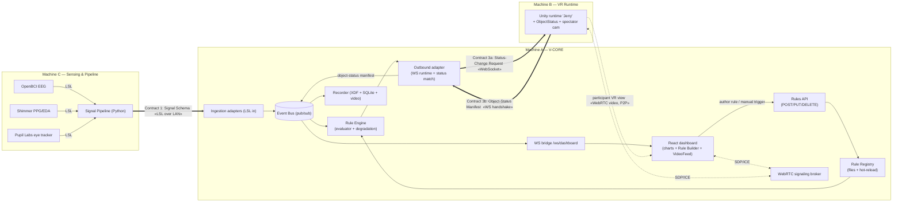

# V-CORE — Architecture

**V-CORE** — *VR Cognitive-state Observation, Rules & Environment adaptation*

| | |
|---|---|
| **Status** | Design approved · implementation gated on per-phase `APPROVE` (see [`TODO.md`](./TODO.md)) |
| **Doc version** | 1.2.0 (A1: rule authoring + object-status context · A2: participant video mirror + recording + manual rule trigger) |
| **Date** | 2026-06-01 |
| **Contracts version** | 1.0.0 (Signal Schema · Rule Grammar · Object-Status / Status-Request) |

> This document is the **single source of truth** for the V-CORE architecture. If the plan
> changes, change this file and [`TODO.md`](./TODO.md) first.

---

## Table of contents

1. [System overview](#1-system-overview)
2. [End-to-end data flow](#2-end-to-end-data-flow)
3. [Tech stack & rationale](#3-tech-stack--rationale)
4. [Design patterns](#4-design-patterns)
5. [The three contracts (formal specs)](#5-the-three-contracts-formal-specifications)
6. [Versioning & compatibility](#6-versioning--compatibility-policy)
7. [File & folder structure](#7-file--folder-structure)
8. [Data-flow walkthroughs](#8-data-flow-walkthroughs)
9. [Failure modes & graceful degradation](#9-failure-modes--graceful-degradation)
10. [Deployment & configuration](#10-deployment--configuration)
11. [Participant video mirror & recording](#11-participant-video-mirror--recording-webrtc)
12. [Testing & reproducibility](#12-testing--reproducibility)
13. [Open questions & assumptions](#13-open-questions--assumptions)
14. [Glossary](#14-glossary)

---

## 1. System overview

V-CORE is the **middleware** in a real-time VR cognitive-state monitoring and adaptation
research platform. It sits between a physiological-sensing pipeline and a VR runtime and is
responsible for:

- a **schema-driven Dashboard** that renders *whatever signal channels the pipeline
  declares* (no UI code changes when channels change), lets the researcher **author rules
  from the browser**, and — during a session — shows a **live mirror of the participant's VR
  view** alongside the signals; and
- a **Rule Engine** that evaluates declarative rules against the live signals and emits
  **object-status change requests** to the VR runtime (automatically, or on a researcher's
  manual trigger).

### The one hard constraint: plug-and-play along three axes

The platform must be modular along three independent axes, with **no changes to V-CORE's
core code** required to exercise any of them:

| Axis | What can change | Why it stays core-free |
|---|---|---|
| **Indicators** | The pipeline adds/removes signal channels | Dashboard re-renders from the **Signal Schema** manifest via a renderer-by-type registry |
| **Rules** | Rules are authored in the UI or dropped in as files | A registry hot-loads rule files validated against the **Rule Grammar**; the UI writes the same files |
| **VR environments** | The VR scene/runtime is swapped | Each scene declares an **Object-Status Manifest**; rules target abstract **tags**, so any compatible scene responds |

This modularity is a **hard architectural requirement**, achieved by three **versioned
contracts** that keep the core fixed:

| # | Contract | Between | Carries |
|---|----------|---------|---------|
| 1 | **Signal Schema** | Pipeline → Dashboard/Engine | self-describing channels: `name · unit · type · range · display hint` |
| 2 | **Rule Grammar** | Rule files ↔ Engine/UI | declarative `IF (signal · op · threshold · sustain) → THEN (set object status)` |
| 3 | **Object-Status & Status-Request** | Engine ↔ VR Runtime | runtime declares each object's settable statuses; engine sends `{target, status, value}` matched against them |

> **Amendment 1.** Contract 3 is **object-addressable**: each controllable Unity object
> declares an `ObjectStatus` (discrete or continuous), V-CORE **auto-collects** these, uses
> them — with the sensor pipeline's signals — to **auto-populate the rule builder**, and streams status-change
> requests back. *Scene-level **abstract actions** are retained as a commented **skeleton**
> for a future extension — see [§5](#contract-2--rule-grammar-rule-files--engineui).*
>
> **Amendment 2.** The dashboard adds a **live video mirror of the participant's VR view**
> during a session (WebRTC), the option to **record it synced to the signal data**, and a
> **manual rule-trigger** so the researcher can fire a rule on the spot. This is a separate
> **video/control plane that does not change the three contracts** — see
> [§11](#11-participant-video-mirror--recording-webrtc).

### Project context

V-CORE is one component of a larger research effort; its neighbours are referenced only
through their contracts:

- **Sensor pipeline** — the Python signal-processing pipeline; emits self-describing channels over **LSL**.
- **"Jerry"** — a Unity runtime (one of several swappable environments; *need not be VR*).
  Each scene declares an **Object-Status Manifest**. Because the partner *will not
  co-develop*, V-CORE ships a **thin Unity reference POC** (`unity-poc/`) so the whole loop —
  including the video mirror — is demonstrable on its own.

Because the neighbours are external, **the contracts are public interfaces** and live in
[`contracts/`](./contracts) as first-class, versioned, independently-testable artefacts.

---

## 2. End-to-end data flow

The system spans **three machines** on a lab LAN. V-CORE itself does not change to support
this — LSL is network-transparent and clock-synced, and the Unity control link is a
WebSocket; the machine boundaries are a **configuration** concern
(see [§10](#10-deployment--configuration)).



**Reading the diagram:**

- **Contract 1** crosses the LAN from the sensor pipeline (C) into ingestion (A) over LSL.
- **Contract 2** is local: rule files on disk, loaded by the registry; the **Rule Builder**
  writes the same files via the **Rules API**, and a **manual trigger** can fire a rule on
  demand.
- **Contract 3** is bidirectional over **one WebSocket** between V-CORE (A) and Unity (B):
  the runtime declares its object statuses (3b, up); the engine emits status-change requests
  (3a, down).
- **Video plane (Amendment 2, dashed):** the participant's VR view streams **WebRTC
  peer-to-peer Unity → dashboard**; V-CORE only **brokers signaling** (SDP/ICE) over its
  WebSocket and never touches the video bytes. See [§11](#11-participant-video-mirror--recording-webrtc).
- The **event bus** decouples every producer from every consumer.

---

## 3. Tech stack & rationale

### Options considered

| Axis | **A. Python backend + React/TS web — CHOSEN** | B. Full TypeScript / Node | C. Python end-to-end (PyQt / Dear PyGui) |
|---|---|---|---|
| **LSL ingestion** | `pylsl` — mature BCI/physio standard; aligns with the Python pipeline | `node-lsl` — thin, under-maintained ⚠️ | `pylsl` — mature |
| **Schema-driven UI + video** | React renderer registry + `<video>`/WebRTC are first-class in the browser | Same (React) | Hard / un-idiomatic; embedding live WebRTC video is painful |
| **Rule engine + authoring** | Python; hot-reload files + a write-API; React form-builder | TypeScript | Python; native-GUI form-building is clumsy |
| **Unity messaging** | **WebSocket** (control) + **WebRTC** (video) — both browser-native, no native deps | `zeromq.js` / WS | `pyzmq` / WS |
| **Contract sharing** | JSON Schema is language-neutral → validated by **both** Python and TS | Single TS type source, but couples the contract to TS | Single Python source, no web type-gen |
| **Testability / repro** | pytest + vitest/RTL + golden-payload contract tests | Good DX, one language | Native-GUI testing is harder |
| **Primary risk** | Two runtimes + WS/WebRTC (well-trodden) | **LSL on Node is the weak link** | **Dynamic schema-driven UI + browser video is the weak link** |

### Decision: Option A, and why

1. **Put LSL where LSL lives.** `pylsl` is the de-facto standard and matches the Python
   pipeline. It is **network-transparent and clock-synced** — right with the sensor pipeline on a separate
   machine, and the same LSL clock aligns the recorded video to the signals
   ([§11](#11-participant-video-mirror--recording-webrtc)).
2. **Put the schema-driven UI where it is idiomatic.** The renderer-by-type registry, the
   Rule Builder, **and live WebRTC video in a `<video>` element** are all browser-native.
   Native Python GUIs (C) fight all three.
3. **Make the contracts language-neutral.** Contracts are authored as **JSON Schema** in
   [`contracts/`](./contracts) and validated on **both** sides (`jsonschema` / `pydantic`;
   `ajv` + `json-schema-to-typescript`). The contract — not either codebase — is the single
   source of truth.
4. **WebSocket for control, WebRTC for video.** The Unity *control* link is bidirectional,
   low-rate commands + a manifest handshake — a WebSocket's sweet spot, no NetMQ dependency,
   ZMQ swappable behind the adapter. The participant *video* is real-time media → **WebRTC**
   (UDP, encrypted, peer-to-peer), with V-CORE only as the signaling broker so video
   bandwidth never touches the control/data plane.

### Final stack

| Layer | Choice |
|---|---|
| Backend runtime | **Python 3.11**, **FastAPI** + **uvicorn** |
| LSL ingestion | **pylsl** |
| Unity control messaging | **WebSocket** (FastAPI server ↔ Unity WS client); ZMQ swappable behind the adapter |
| Participant video | **WebRTC** (Unity `com.unity.webrtc` → browser); V-CORE = signaling broker; MJPEG-over-WS POC fallback |
| Models / validation | **pydantic** + **jsonschema** |
| Rule hot-reload / authoring | **watchdog** + FastAPI **Rules API** (`/api/rules`) → YAML/JSON files |
| Recording | **XDF** (raw streams) + **SQLite** (sessions/events) + **session video file** (synced via LSL clock) |
| Frontend | **React 18** + **TypeScript** + **Vite** (browser web app) |
| Frontend validation/types | **ajv** + **json-schema-to-typescript** |
| Charts / state | lightweight chart lib (**uPlot**/**visx**) + **Zustand** |
| Unity POC | thin C# reference (`unity-poc/`): `ObjectStatus` + WS client + auto-collect + dispatch + spectator-cam WebRTC sender |
| Tests | **pytest** · **vitest** + **React Testing Library** · cross-language **contract tests** |

### Resolved product decisions

- **Dashboard delivery:** browser web app (Vite); backend stays Python.
- **Persistence:** raw streams → **XDF**; session metadata + events → **SQLite**;
  **participant video → a session video file**, all timestamp-synced via the LSL clock.
- **Topology:** **three machines** — V-CORE/A, Unity/B, Pipeline/C — on a lab LAN; endpoints are
  configuration ([§10](#10-deployment--configuration)).
- **Unity context model:** **per-object statuses** (primary) + an **abstract-action
  skeleton**. **WebSocket** control transport. **Thin, package-ready Unity POC.** Rules
  authored in the UI are **saved as files** via the Rules API.
- **Participant video (Amendment 2):** **live mirror + recording synced to signals**, mono
  spectator camera, **WebRTC** transport with V-CORE as signaling broker.

---

## 4. Design patterns

Each pattern satisfies a specific requirement — not chosen for its own sake.

| Pattern | Where it lives | Requirement it satisfies |
|---|---|---|
| **Registry** | `engine/registry.py` (rules); `frontend/renderers/registry.ts` (renderers) | Rules in hot-loaded files; indicators re-render purely from the manifest |
| **Strategy / renderer-by-type** | dashboard component selection by `type`/`display.hint` | Schema-driven UI **and** a **fallback renderer** for unknown types |
| **Adapter** | `ingestion/*` (sensors in), `outbound/*` (runtime out) | Swappable sensors & VR runtimes; transport (WS/ZMQ/LSL) isolated behind a stable interface |
| **Publish/Subscribe (event bus)** | `core/eventbus.py` | Decoupled real-time flow: ingestion → engine → outbound, bus → WS → UI |
| **Schema validation + semver** | `core/schema.py` + `contracts/` | Versioned contracts validated on both sides; basis for **graceful degradation** |
| **Capability negotiation (handshake)** | `outbound/base.py` ↔ object-status manifest | Rule targets matched to a scene's real objects; disable-and-warn on mismatch |
| **Auto-discovery (collector)** | `unity-poc/StatusCollector.cs` | Scene self-scan for `ObjectStatus` → manifest, zero per-object wiring |
| **Write-through authoring** | `api/rules.py` → `backend/rules/` | UI authors rules but **files stay the single source of truth** |
| **Signaling broker** | `bridge/signaling.py` | Connects the WebRTC video peers (Unity ↔ browser) **without V-CORE relaying the media** |
| **Composition root** | `app.py` | One wiring point; adapters/transports injected from `config.yaml`, keeping the core environment-free |

---

## 5. The three contracts (formal specifications)

*Unchanged by Amendment 2.* All schema files live in [`contracts/`](./contracts) as **JSON
Schema (draft 2020-12)**, the **single source of truth**, validated on both sides. Golden
examples (valid + deliberately-invalid) in `contracts/examples/` drive cross-language tests.

> **Design note — open at the edges, strict at the core.** `display.hint`, status `name`s,
> object `tags`, and the (skeleton) `action` are free **strings** on purpose: an unknown one
> must **validate** so the system degrades gracefully (fallback renderer / disable-and-warn)
> rather than rejecting the payload. Structural fields (`type`, `op`, `schema_version`) stay
> strict.

### Contract 1 — Signal Schema  *(Pipeline → Dashboard/Engine)*

Self-describing channels, carried as the LSL stream's XML header and/or a sidecar JSON
manifest.

```jsonc
// contracts/signal_schema.schema.json
{
  "$schema": "https://json-schema.org/draft/2020-12/schema",
  "$id": "https://v-core.research/contracts/signal_schema/1.0.0",
  "title": "V-CORE Signal Schema",
  "type": "object",
  "required": ["schema_version", "stream", "channels"],
  "properties": {
    "schema_version": { "type": "string", "pattern": "^\\d+\\.\\d+\\.\\d+$" },
    "stream": {
      "type": "object",
      "required": ["name", "source_id"],
      "properties": {
        "name":          { "type": "string" },
        "source_id":     { "type": "string" },
        "nominal_srate": { "type": "number", "minimum": 0 }
      }
    },
    "channels": { "type": "array", "minItems": 1, "items": { "$ref": "#/$defs/channel" } }
  },
  "$defs": {
    "channel": {
      "type": "object",
      "required": ["name", "type", "unit"],
      "properties": {
        "name":       { "type": "string" },
        "unit":       { "type": "string" },
        "type":       { "enum": ["scalar", "timeseries", "categorical"] },
        "range":      { "type": "object", "required": ["min","max"],
                        "properties": { "min": {"type":"number"}, "max": {"type":"number"} } },
        "categories": { "type": "array", "items": { "type": "string" } },
        "display": {
          "type": "object",
          "required": ["hint"],
          "properties": {
            "hint":      { "type": "string" },                       // free string → fallback if unknown
            "label":     { "type": "string" },
            "precision": { "type": "integer", "minimum": 0 },
            "window_s":  { "type": "number",  "minimum": 0 }
          }
        }
      },
      "allOf": [
        { "if":   { "properties": { "type": { "const": "categorical" } } },
          "then": { "required": ["categories"] } }
      ]
    }
  }
}
```

This auto-populates the **IF** side of the Rule Builder.

### Contract 2 — Rule Grammar  *(Rule files ↔ Engine/UI)*

One rule per file (YAML or JSON), hot-loaded by the registry **and** authored by the UI via
the Rules API. The `THEN` clause sets an **object status**; scene-level **abstract actions**
are present only as a documented `$comment` **skeleton**.

```jsonc
// contracts/rule_grammar.schema.json
{
  "$schema": "https://json-schema.org/draft/2020-12/schema",
  "$id": "https://v-core.research/contracts/rule_grammar/1.0.0",
  "title": "V-CORE Rule",
  "type": "object",
  "required": ["id", "schema_version", "when", "then"],
  "properties": {
    "id":             { "type": "string", "pattern": "^[a-z0-9-]+$" },
    "schema_version": { "type": "string", "pattern": "^\\d+\\.\\d+\\.\\d+$" },
    "description":    { "type": "string" },
    "enabled":        { "type": "boolean", "default": true },
    "when":           { "$ref": "#/$defs/condition_group" },
    "then":           { "$ref": "#/$defs/then" }
  },
  "$defs": {
    "condition": {
      "type": "object",
      "required": ["signal", "op", "threshold"],
      "properties": {
        "signal":    { "type": "string" },
        "op":        { "enum": [">", ">=", "<", "<=", "==", "!=", "between"] },
        "threshold": { "type": ["number", "string", "array"] },  // number | category | [lo,hi] for "between"
        "sustain_s": { "type": "number", "minimum": 0, "default": 0 }
      }
    },
    "condition_group": {
      "type": "object",
      "oneOf": [
        { "required": ["all"], "properties": { "all": { "type": "array", "minItems": 1,
            "items": { "$ref": "#/$defs/condition" } } } },
        { "required": ["any"], "properties": { "any": { "type": "array", "minItems": 1,
            "items": { "$ref": "#/$defs/condition" } } } }
      ]
    },

    "then": {
      "$comment": "Amendment 1: THEN sets an object status. FUTURE (abstract actions): make `then` a oneOf [ {set,...}, {action,params,...} ] using $defs/abstract_action. Not wired in yet.",
      "type": "object",
      "required": ["set"],
      "properties": {
        "set":        { "$ref": "#/$defs/status_set" },
        "cooldown_s": { "type": "number", "minimum": 0, "default": 0 }
      }
    },
    "status_set": {
      "type": "object",
      "required": ["target", "status", "value"],
      "properties": {
        "target": { "$ref": "#/$defs/target" },
        "status": { "type": "string" },
        "value":  { "type": ["number", "string"] }   // number = continuous · string = discrete state
      }
    },
    "target": {
      "type": "object",
      "oneOf": [
        { "required": ["tag"], "properties": { "tag": { "type": "string" } } },  // portable across scenes
        { "required": ["id"],  "properties": { "id":  { "type": "string" } } }   // one specific object
      ]
    },

    "abstract_action": {
      "$comment": "SKELETON — future extension, NOT referenced by `then` yet. A scene-level semantic command (e.g. reduce_visual_load) interpreted by a scene manager.",
      "type": "object",
      "required": ["action"],
      "properties": { "action": { "type": "string" }, "params": { "type": "object" } }
    }
  }
}
```

**Example rule** (`backend/rules/overload-dim-lights.yaml`):

```yaml
id: overload-dim-lights
schema_version: "1.0.0"
description: "Sustained high cognitive load → dim the ambient lighting."
enabled: true
when:
  all:
    - { signal: cognitive_load, op: ">=", threshold: 0.8, sustain_s: 5 }
then:
  set:
    target: { tag: ambient_light }    # any object tagged ambient_light · or { id: campfire_01 }
    status: brightness
    value: 20                         # continuous 0–100  (a discrete status would use a string, e.g. "low")
  cooldown_s: 30

# --- FUTURE (skeleton, not yet supported) — scene-level abstract action ---
# then:
#   action: reduce_visual_load
#   params: { intensity: 0.5 }
```

**Semantics:** `between` expects `threshold:[lo,hi]`; `==`/`!=` may compare a category
string. `sustain_s` = hold continuously before firing; `cooldown_s` = refractory period. A
rule whose `signal` is absent, or whose `set` does not resolve against the active
Object-Status Manifest, is **disabled + warned** — never a crash.

### Contract 3 — Object-Status & Status-Request  *(Engine ↔ VR Runtime, over WebSocket)*

**3a — Status-Change Request** (Engine → Unity):

```jsonc
// contracts/status_request.schema.json
{
  "$schema": "https://json-schema.org/draft/2020-12/schema",
  "$id": "https://v-core.research/contracts/status_request/1.0.0",
  "title": "V-CORE Status-Change Request",
  "type": "object",
  "required": ["schema_version", "intent_id", "timestamp", "target", "status", "value"],
  "properties": {
    "schema_version": { "type": "string", "pattern": "^\\d+\\.\\d+\\.\\d+$" },
    "intent_id":      { "type": "string", "format": "uuid" },
    "timestamp":      { "type": "string", "format": "date-time" },
    "target":         { "type": "object", "oneOf": [
                          { "required": ["tag"], "properties": { "tag": { "type": "string" } } },
                          { "required": ["id"],  "properties": { "id":  { "type": "string" } } } ] },
    "status":         { "type": "string" },
    "value":          { "type": ["number", "string"] },
    "source_rule":    { "type": "string" },
    "source":         { "enum": ["engine", "manual"] }   // manual = researcher-triggered (Amendment 2)
  }
}
```

```json
{ "schema_version": "1.0.0", "intent_id": "3f1c…-uuid", "timestamp": "2026-06-01T12:00:00.000Z",
  "target": { "tag": "ambient_light" }, "status": "brightness", "value": 20,
  "source_rule": "overload-dim-lights", "source": "engine" }
```

**3b — Object-Status Manifest** (Unity scene → Engine, on connect):

```jsonc
// contracts/object_status_manifest.schema.json
{
  "$schema": "https://json-schema.org/draft/2020-12/schema",
  "$id": "https://v-core.research/contracts/object_status_manifest/1.0.0",
  "title": "V-CORE Object-Status Manifest",
  "type": "object",
  "required": ["schema_version", "scene", "runtime", "objects"],
  "properties": {
    "schema_version": { "type": "string", "pattern": "^\\d+\\.\\d+\\.\\d+$" },
    "scene":          { "type": "string" },
    "runtime":        { "type": "string" },
    "objects": {
      "type": "array",
      "items": {
        "type": "object",
        "required": ["id", "statuses"],
        "properties": {
          "id":       { "type": "string" },
          "tags":     { "type": "array", "items": { "type": "string" } },
          "statuses": { "type": "array", "items": { "$ref": "#/$defs/status_decl" } }
        }
      }
    },
    "abstract_actions": {
      "$comment": "SKELETON — future extension. Scene-level semantic actions. Empty for now.",
      "type": "array", "items": { "type": "object" }, "default": []
    }
  },
  "$defs": {
    "status_decl": {
      "type": "object",
      "required": ["name", "type"],
      "properties": {
        "name":   { "type": "string" },
        "type":   { "enum": ["discrete", "continuous"] },
        "values": { "type": "array", "items": { "type": "string" } },                 // discrete
        "range":  { "type": "object", "required": ["min","max"],
                    "properties": { "min": {"type":"number"}, "max": {"type":"number"} } }  // continuous
      },
      "allOf": [
        { "if": { "properties": { "type": { "const": "discrete"   } } }, "then": { "required": ["values"] } },
        { "if": { "properties": { "type": { "const": "continuous" } } }, "then": { "required": ["range"]  } }
      ]
    }
  }
}
```

```json
{ "schema_version": "1.0.0", "scene": "calm_forest", "runtime": "jerry-unity",
  "objects": [
    { "id": "campfire_01", "tags": ["ambient_light", "fire"],
      "statuses": [
        { "name": "brightness", "type": "continuous", "range": { "min": 0, "max": 100 } },
        { "name": "crackle",    "type": "discrete",   "values": ["off", "low", "high"] }
      ] }
  ],
  "abstract_actions": [] }
```

**Handshake & matching:** Unity opens a WebSocket (`/ws/runtime`), sends its manifest; the
engine validates + indexes by `id`/`tag` and forwards it to the dashboard (the **THEN** side
of the Rule Builder). Each rule's `then.set` must resolve to a real object/status with a
valid value, else it is **disabled + warned**. On fire (or manual trigger), the engine sends
a **Status-Change Request** down the same WebSocket; Unity's `OnRequest()` dispatches it.
Unresolved targets are **dropped + warned**.

---

## 6. Versioning & compatibility policy

Every payload carries a `schema_version` (SemVer). Full policy + matrix in
[`contracts/VERSIONING.md`](./contracts/VERSIONING.md):

| Skew vs supported version | Behaviour |
|---|---|
| **Patch** (`1.0.x`) | Accept silently |
| **Minor** (`1.x.0`) | Accept **best-effort + warning**; unknown additive fields ignored |
| **Major** (`x.0.0`) | **Refuse** that stream/rule/runtime + **blocking warning** |

Validators must **ignore unknown additive properties** rather than reject them.

---

## 7. File & folder structure

⛔ stable core · 🔌 extension point · ⭐ single source of truth · 🌐 network config ·
1️⃣ Amendment 1 · 2️⃣ Amendment 2.

```
p4p/
├── ARCHITECTURE.md  TODO.md  README.md  docker-compose.yml
│
├── contracts/                          # ⭐ SINGLE SOURCE OF TRUTH — language-neutral JSON Schema
│   ├── signal_schema.schema.json          #   Contract 1
│   ├── rule_grammar.schema.json           #   Contract 2 (then.set + abstract-action skeleton)
│   ├── status_request.schema.json      # 1️⃣ Contract 3a (engine → runtime)
│   ├── object_status_manifest.schema.json # 1️⃣ Contract 3b (runtime → engine)
│   ├── examples/                          #   golden payloads (valid + invalid) → contract tests
│   └── VERSIONING.md
│
├── backend/                            # Python · FastAPI
│   ├── pyproject.toml
│   ├── config.example.yaml             # 🌐 LSL streams · runtime WS · WS bind · video · auth
│   ├── rules/                          # 🔌 PLUGIN DIR — YAML/JSON rule files (UI writes here too)
│   │   └── overload-dim-lights.yaml
│   ├── vcore/
│   │   ├── core/                       # ⛔ eventbus.py · schema.py · models.py
│   │   ├── ingestion/                  # 🔌 base.py · lsl_source.py · replay_source.py
│   │   ├── engine/                     #   registry.py · evaluator.py · degradation.py
│   │   ├── outbound/                   # 🔌 base.py · ws_sink.py (1️⃣ primary) · zmq_sink.py (stub)
│   │   ├── api/                        # 1️⃣ rules.py — POST/PUT/DELETE /api/rules + manual-trigger (2️⃣)
│   │   ├── recording/                  #   xdf_writer.py · sqlite_store.py · video_store.py (2️⃣)
│   │   ├── bridge/
│   │   │   ├── ws.py                   # 1️⃣ /ws/dashboard · /ws/runtime
│   │   │   └── signaling.py            # 2️⃣ WebRTC SDP/ICE broker (no media relay)
│   │   └── app.py                      #   composition root: loads config.yaml, wires adapters
│   └── tests/
│
├── frontend/                           # React · TypeScript · Vite
│   ├── package.json
│   ├── src/
│   │   ├── contracts/                  #   TS types generated from /contracts
│   │   ├── renderers/                  # 🔌 registry.ts · StatCard · LineChart · Quadrant · FallbackRenderer ⭐
│   │   ├── screens/
│   │   │   ├── NewSession/             #   start/stop a session (begins recording + video)
│   │   │   ├── SessionMonitor/         # 2️⃣ charts + VideoFeed (participant view) + rule activity + manual trigger
│   │   │   ├── RuleManager/            # 1️⃣ rule list + RuleBuilder
│   │   │   └── DataHistory/ · SystemConfig/
│   │   ├── video/                      # 2️⃣ WebRTC client (RTCPeerConnection) + VideoFeed component
│   │   ├── ws/                         #   websocket client + reconnect
│   │   └── store/
│   └── tests/
│
├── unity-poc/                          # 1️⃣/2️⃣ thin Unity reference (package-ready)
│   ├── Assets/Scripts/
│   │   ├── ObjectStatus.cs             #   declare discrete/continuous statuses on a GameObject
│   │   ├── VCoreConnection.cs          #   WS client (manifest up, requests down)
│   │   ├── StatusCollector.cs          #   auto-collect ObjectStatus → manifest
│   │   ├── RequestDispatcher.cs        #   OnRequest() → apply value to matching objects
│   │   ├── SpectatorCamera.cs          # 2️⃣ mono camera mirroring the participant view
│   │   ├── WebRtcSender.cs             # 2️⃣ encode + send the spectator cam (com.unity.webrtc)
│   │   └── VideoRecorder.cs            # 2️⃣ record the spectator cam, LSL-stamped (optional)
│   └── Assets/Scenes/Sample.unity
│
├── tools/                              # schema→TS codegen · schema lint · mock_pipeline.py · mock_unity.py (WS)
└── docs/
```

---

## 8. Data-flow walkthroughs

### Walkthrough A — a new pupil-dilation indicator is added (zero core changes)

> **Axis 1 (indicators).**

1. The sensor pipeline adds a `pupil_diameter` channel (`timeseries`, `mm`, `display.hint: line_chart`),
   minor-bumps `schema_version`.
2. `ingestion/lsl_source.py` reads it; `core/schema.py` validates + version-checks (minor →
   accept) and publishes `manifest.updated`.
3. `bridge/ws.py` (`/ws/dashboard`) forwards it; the store swaps the active manifest.
4. Session Monitor asks `renderers/registry.ts`: `timeseries`/`line_chart` → `LineChart`. A
   new chart appears and `pupil_diameter` becomes selectable as an **IF**. **No code changed.**
5. Unknown `display.hint` → `FallbackRenderer` (raw value + badge).

### Walkthrough B — author a rule that dims lights; works in Env A, degrades in Env B

> **Axes 2 + 3 + graceful degradation.**

1. A developer drops `ObjectStatus` on a `campfire` (tag `ambient_light`, `brightness:
   continuous 0–100`).
2. On play, `StatusCollector.cs` builds the **Object-Status Manifest**; `VCoreConnection.cs`
   sends it over `/ws/runtime`; V-CORE indexes it and forwards it to the dashboard.
3. In the **Rule Builder** the user picks **IF** `cognitive_load >= 0.8` sustained 5 s (from
   the sensor pipeline) and **THEN** `set tag:ambient_light brightness = 20` (from Unity), and saves;
   `api/rules.py` validates and writes `backend/rules/overload-dim-lights.yaml`.
4. The registry hot-reloads it; `degradation.py` reconciles — `ambient_light` resolves,
   `20 ∈ [0,100]` → **enabled**.
5. Load holds ≥ 0.8 for 5 s → engine sends `{target:{tag:ambient_light}, status:brightness,
   value:20, source:"engine"}` over the WebSocket; `RequestDispatcher.cs` dims the campfire;
   30 s cooldown begins.
6. **Env B (`space_station`)** has no `ambient_light` object → on its handshake the rule's
   target is unresolved → **disabled for B + warning**. No crash.

### Walkthrough C — run a study session: live mirror, manual trigger, synced recording (Amendment 2)

> **Amendment 2 end-to-end.**

1. The researcher hits **Start Session** (New Session). V-CORE opens a session: starts the
   XDF recorder + SQLite session row, and triggers the **WebRTC signaling** handshake (SDP/ICE
   over the WS, brokered by `bridge/signaling.py`).
2. The participant's **spectator-camera view streams WebRTC peer-to-peer Unity → dashboard**;
   the **VideoFeed** panel in Session Monitor shows it next to the live signal charts and
   rule activity. Unity also begins recording that camera locally, stamped with the session's
   LSL start time.
3. The researcher watches the participant get overwhelmed and clicks **Activate** on
   `overload-dim-lights` → a `source:"manual"` status request fires immediately over the
   WebSocket → lights dim — logged as a researcher-triggered event.
4. On **End Session**, the video stream tears down; Unity uploads its recording to V-CORE,
   which stores it in the session folder beside the XDF + SQLite and registers it in **Data
   History** — all aligned on the LSL clock for later review.

---

## 9. Failure modes & graceful degradation

Graceful degradation is **mandatory**: a mismatch is a warning, never a crash. Each row has a
test in Phase 8 of [`TODO.md`](./TODO.md).

| Condition | Detected by | Behaviour |
|---|---|---|
| Rule references an **absent signal** | `engine/degradation.py` | Rule **disabled + warning**; others unaffected |
| Rule **target/status unresolved** (no matching object/tag, or value out of range/values) | object-status reconciliation | Rule **disabled + warning**; request never emitted |
| **Unknown channel type / display hint** | `renderers/registry.ts` lookup miss | **FallbackRenderer** (raw value + badge) |
| **Schema version skew** | `core/schema.py` SemVer compare | patch/minor → warn + best-effort; **major → refuse + blocking warning** |
| **Control-link drop** — Pipeline↔A **LSL**, A↔Unity **WS**, A↔browser **WS** | per-adapter heartbeats / connection state | Each **reconnects with backoff independently**; **per-link status** in System Config / Session Monitor; a down Unity link drops requests without crashing the engine |
| **Video-link drop / WebRTC fails** (Amendment 2) | `RTCPeerConnection` state / ICE failure | **VideoFeed shows "reconnecting"**; renegotiate; **the session, recording, signals, and rule engine are unaffected** (video is a separate plane) |
| **Stale signal** (stream up, no recent samples) | last-sample timeout | Channel **stale**; rules referencing it **do not fire on stale data** |
| **Malformed rule file** / rejected by the Rules API | `engine/registry.py` / `api/rules.py` | File **skipped** / API returns a clear error; other rules load normally |
| **Invalid contract payload** | `jsonschema` / `ajv` | Rejected at the boundary; the rest of the system is unaffected |

**Principles:** validate at every boundary; failures are *local*; every degradation is
*visible* in the UI.

---

## 10. Deployment & configuration

### Topology — three machines on a lab LAN

| Machine | Runs | Talks to |
|---|---|---|
| **A** | V-CORE (backend + served dashboard) | ← LSL from C · ↔ WS with B · → WS to browsers · brokers WebRTC signaling |
| **B** | Unity VR runtime "Jerry" | ↔ WS with A · → WebRTC video to the dashboard |
| **C** | Sensor pipeline | → LSL to A |

The dashboard is served by A and opened from any LAN machine. The WebRTC video flows
**directly Unity (B) → browser** (peer-to-peer); V-CORE only brokers the connection setup.

### `config.yaml` (example)

```yaml
ingestion:
  transport: lsl
  streams:
    - { name: sensor.cognitive, manifest: lsl_header }   # lsl_header | sidecar:<path>
  stale_timeout_s: 2.0
  # known_peers: ["192.168.1.42"]   # only if LSL multicast discovery is blocked across subnets

outbound:
  transport: ws                   # ws (default) | zmq
  runtime_ws_path: /ws/runtime
  # zmq_endpoint: tcp://machine-b.lan:5556

video:                            # Amendment 2
  enabled: true
  transport: webrtc               # webrtc (default) | mjpeg (POC fallback)
  camera: spectator_mono
  resolution: 1280x720
  fps: 30
  signaling_path: /ws/signaling
  record: true                    # capture participant view, synced to signals
  store_dir: ./data/sessions

bridge:
  ws_bind: 0.0.0.0:8000
  auth: { enabled: false, bearer_token: "" }   # recommend enabling off an isolated LAN

recording:
  xdf_dir: ./data/sessions
  sqlite_path: ./data/vcore.db
```

### Network & security notes

- **Discovery:** LSL resolves streams by name via multicast on a flat LAN; set `known_peers`
  across subnets. Unity connects *out* to A for both the WS and the WebRTC signaling, so only
  A needs a reachable bound interface; WebRTC's ICE then establishes the direct media path.
- **Time sync:** the LSL clock aligns signals, events, and the recorded video (offsets stored
  in XDF) — the basis for reproducible session review.
- **Security:** an **isolated lab LAN** is assumed (plaintext LSL on the wire — a known
  limitation for the ethics write-up). Notably, **WebRTC media is encrypted by default
  (DTLS-SRTP)**, so the participant video is encrypted end-to-end even on the LAN. Optional
  **WS bearer-token** covers the dashboard, runtime, and signaling channels.

---

## 11. Participant video mirror & recording (WebRTC)

*(Amendment 2.)* During a study session the researcher must see, in real time, **what the
participant sees in the headset**, beside the live signals — and that view is **recorded
synced to the signals** for later review. This is a **separate video plane**; it does **not**
change the three contracts.

### Pipeline

```
Unity spectator cam ──encode──▶ WebRTC (DTLS-SRTP, P2P over LAN) ──▶ browser <video>
                    └─record──▶ session video file (LSL-stamped) ──▶ V-CORE Data History
        (SDP/ICE setup brokered by V-CORE bridge/signaling.py over the dashboard WS)
```

- **Capture:** a **mono spectator camera** rendering the participant's view (one eye of the
  stereo pair — full stereo doubles bandwidth for no monitoring benefit). Default 720p @
  30 fps, configurable.
- **Transport:** **WebRTC peer-to-peer Unity → browser** (Unity `com.unity.webrtc` → the
  browser's `RTCPeerConnection` → a `<video>` element). UDP-based and built for real-time;
  **~50–150 ms glass-to-glass on a LAN**.
- **V-CORE's role = signaling only.** `bridge/signaling.py` relays the SDP offer/answer + ICE
  candidates between the two peers over the existing WebSocket. **V-CORE never relays the
  media**, so video bandwidth never touches the control/data plane.
- **Fallback:** `video.transport: mjpeg` streams JPEG frames over the WebSocket to a
  `<canvas>` — simpler for an early POC, higher latency/bandwidth, not for smooth use.

### Recording (synced to signals)

- **Record at the source:** Unity captures the spectator camera to a session video file
  (highest quality, independent of live-stream conditions), stamped with the session's **LSL
  start time**. At session end it is uploaded to V-CORE and stored in the session folder
  beside the XDF + SQLite, registered in **Data History**.
- **Synchronisation** is via the shared **LSL clock** — the same basis used for XDF — so the
  video and the signal traces line up on review (do *not* rely on the live display, whose
  latencies differ). *Alternative (noted):* server-side recording via a recv-only WebRTC peer
  (`aiortc`) lands the file on A with no upload step but puts V-CORE in the video path.

### Manual rule trigger

The researcher can **fire a rule on the spot** from Session Monitor (the "Activate" button):
a dashboard control → `/api/rules/{id}/trigger` (or a WS message) → the engine emits the
rule's status request immediately with `source: "manual"`, in addition to automatic
condition-based firing. It is recorded as a researcher-attributed event for the session log.

### Latency & sync at a glance

| Path | Latency | Limited by |
|---|---|---|
| Manual trigger → effect in Unity | ~15–25 ms | one Unity render frame, not the WS |
| Participant video → dashboard | ~50–150 ms (LAN) | WebRTC encode/transport |

The live video and the live charts have slightly different latencies; for a human-in-the-loop
trigger this is harmless, and the **recordings** are aligned precisely via LSL timestamps.

### Privacy

The participant's view + physiological signals are human-subjects data: consent, retention,
and the isolated-LAN assumption apply. WebRTC's default DTLS-SRTP encryption already protects
the video on the wire.

---

## 12. Testing & reproducibility

- **Contract tests (cross-language):** every golden in `contracts/examples/` validated on
  **both** Python (`jsonschema`) and TS (`ajv`) in CI — valid pass, invalid fail.
- **Hardware-free dev:** `ingestion/replay_source.py`, `tools/mock_pipeline.py` (Signal
  Schema + synthetic signals over LSL) and `tools/mock_unity.py` (headless WS client:
  Object-Status Manifest + logs requests; can emit a WebRTC **test-pattern** stream for the
  VideoFeed) make the whole system runnable with **no sensors and no Unity**.
- **End-to-end smoke test:** mock-pipeline → V-CORE → rule fires → mock-Unity receives a
  resolved request → recorded to XDF + SQLite. Cross-host or loopback.
- **Video-plane tests:** the signaling handshake completes against a test peer; a dropped
  WebRTC connection renegotiates without affecting the session/recording/engine; a recorded
  session video carries the LSL start marker.
- **Unity POC** doubles as a live integration test of the WS + WebRTC protocols.
- **Degradation tests:** every row of [§9](#9-failure-modes--graceful-degradation) asserts
  *disable-and-warn*, not crash.
- **Reproducibility:** raw streams → **XDF** (with clock offsets) replay bit-for-bit through
  `replay_source.py`; the session video aligns to them via LSL timestamps.

---

## 13. Open questions & assumptions

Defaults are chosen so none block progress; flag any to change.

1. **Topology — 3 machines** (V-CORE/A, Unity/B, Pipeline/C) on an **isolated lab LAN** (flat
   subnet for LSL multicast; `known_peers` covers cross-subnet). Plaintext LSL accepted on an
   isolated network; WebRTC video is encrypted by default.
2. **Unity control transport — RESOLVED: WebSocket** (Unity as WS client); ZMQ swappable.
3. **Unity context model — RESOLVED: per-object statuses**; abstract actions are a documented
   skeleton.
4. **Unity ownership — RESOLVED:** thin, package-ready Unity POC (`unity-poc/`) doubling as
   the integration mock. *Open:* promote to a full UPM package later (stretch goal).
5. **Rule authoring — RESOLVED:** UI writes rule **files** via `POST /api/rules`; files stay
   the single source of truth.
6. **Participant video (Amendment 2) — RESOLVED: live mirror + recording synced to signals**,
   mono spectator camera, **WebRTC** with V-CORE as signaling broker. *Open:* (a) record at
   the source (Unity-side, recommended) vs server-side `aiortc`; (b) one researcher/viewer
   assumed → P2P; add an SFU only if many simultaneous viewers are needed.
7. **Rule file format:** **YAML** authored + JSON-Schema validated; loader also accepts JSON.
8. **Hardware availability:** assumed not guaranteed → `replay_source` + `mock_pipeline` +
   `mock_unity` keep everything testable without hardware.

---

## 14. Glossary

| Term | Meaning |
|---|---|
| **LSL** | *Lab Streaming Layer* — time-synced biosignal streaming over a network; native time-correction + discovery. Also the clock that aligns signals, events, and the recorded video. |
| **XDF** | *Extensible Data Format* — the LSL-native recording format; multiple streams + clock offsets. |
| **WebSocket** | Full-duplex TCP connection; carries the Unity **control** link (manifest up, requests down), the dashboard feed, and WebRTC signaling. |
| **WebRTC** | Real-time media transport (UDP, encrypted via **DTLS-SRTP**); carries the **participant video** peer-to-peer Unity → browser. V-CORE only brokers signaling. |
| **Signaling** | The small SDP/ICE handshake that lets two WebRTC peers find each other; brokered by `bridge/signaling.py`. |
| **Spectator camera** | A mono Unity camera mirroring the participant's headset view for the researcher. |
| **ZMQ / NetMQ** | *ZeroMQ* + its C# port — the swappable alternative control transport behind the `ActionSink` adapter; not used by default. |
| **ObjectStatus** | A Unity component declaring an object's settable statuses (discrete / continuous), addressed by tag/id. |
| **Object-Status Manifest** | The runtime's self-description of controllable objects + statuses (Contract 3b). |
| **Status-change request** | An `{target, status, value}` message sent when a rule fires or is manually triggered (Contract 3a). |
| **Abstract action** | A scene-level semantic command — a *skeleton* for a future extension, not implemented. |
| **Renderer-by-type** | UI pattern: pick a component from a registry keyed on a channel's `type`/`display.hint`. |
| **Graceful degradation** | On any mismatch, disable the affected element and surface a warning — never crash. |
| **Sensor pipeline / Jerry** | The external Python signal pipeline, and the codename for the Unity runtime. |
