# V-CORE — Architecture (design reference)

**V-CORE** — *VR Cognitive-state Observation, Rules & Environment adaptation*

> **New here? Read [`docs/HOW_IT_WORKS.md`](./docs/HOW_IT_WORKS.md) first** — that's the
> teaching-style, *as-built* walkthrough of the running system. **This** document is the
> original **design** reference (rationale, patterns, the contract specs, folder layout). It
> predates parts of the implementation; where the two differ, HOW_IT_WORKS and the code win.
> The biggest such difference — the **video plane is now a LiveKit SFU, not the WebRTC
> signaling-broker design described in §2/§3/§11** — is summarised in the deltas below.

| | |
|---|---|
| **Status** | Design approved · implementation gated on per-phase `APPROVE` (see [`TODO.md`](./TODO.md)) |
| **Doc version** | 1.3.0 (A1: rule authoring + object-status context · A2: LiveKit video mirror + recording + manual trigger · A3: abstract actions · behaviour/VR-context contracts · project catalog) |
| **Date** | 2026-06-21 |
| **Contracts version** | 1.0.0 — Signal Schema (1) · Rule Grammar (2) · Object-Status Manifest / Status-Request / Action-Request (3a/3b/3c) · VR Context (4) · Unity Behaviour (5) |

> **⚠ As-built deltas (read first).** This document is the original design reference; the
> implementation has since moved on in the ways below. Where they conflict, the code +
> [`docs/HOW_IT_WORKS.md`](./docs/HOW_IT_WORKS.md) are authoritative.
>
> 1. **Video plane → LiveKit.** The participant-video plane was reimplemented on a **LiveKit SFU**
>    (Unity publishes → browser subscribes → server-side **Track Egress** recording, LSL-anchored).
>    The WebRTC-signaling-broker design below (`bridge/signaling.py`, `WebRtcSender.cs`,
>    `VideoRecorder.cs`, browser `MediaRecorder`, MJPEG fallback) is **superseded and removed** —
>    treat §2's `SIG`/SDP-ICE arrows, §3's WebRTC rows, and §11 as historical. Current video:
>    [`docs/HOW_IT_WORKS.md` §9](./docs/HOW_IT_WORKS.md) + [`docs/LIVEKIT_SETUP.md`](./docs/LIVEKIT_SETUP.md).
> 2. **Abstract actions are implemented** (no longer a skeleton). A rule's `THEN` is now `set`
>    (object status) **or** `action` (a parameterless command) — Contract **3c** (`action_request`),
>    with a `VCoreAction` component on the Unity side. See [§5](#5-the-three-contracts-formal-specifications).
> 3. **Two more contracts shipped:** **Contract 4 — VR Context** (`vr_context`) and **Contract 5 —
>    Unity Behaviour** (`unity_behaviour`: a behaviour manifest + samples that flow through the same
>    pipeline as sensor signals, feeding the dashboard, rule engine, and recorder).
> 4. **Project-wide catalog.** Beyond the per-scene live manifest, the Unity client can bake and send
>    an `object_status_catalog` of every object/action across all scenes + prefabs, so rules can be
>    authored against not-yet-loaded scenes (the live manifest still drives dispatch + degradation).
> 5. **ZMQ transport removed.** Only the WebSocket runtime transport exists; the `ActionSink`
>    adapter seam remains for adding future transports.
> 6. **Reusable Unity client** now ships as an embedded UPM package
>    (`unity-poc/Packages/com.vcore.client`) with a one-component `VCoreLauncher` + `VCore` prefab.
>
> The rest (signals, rules, contracts, recording, degradation) remains accurate.

> This document is the **single source of truth** for the V-CORE architecture. If the plan
> changes, change this file and [`TODO.md`](./TODO.md) first.

---

## Table of contents

1. [System overview](#1-system-overview)
2. [End-to-end data flow](#2-end-to-end-data-flow)
3. [Tech stack & rationale](#3-tech-stack--rationale)
4. [Design patterns](#4-design-patterns)
5. [The three contracts (formal specs)](#5-the-three-contracts-formal-specifications)
6. [Versioning & compatibility](#6-versioning--compatibility-policy)
7. [File & folder structure](#7-file--folder-structure)
8. [Data-flow walkthroughs](#8-data-flow-walkthroughs)
9. [Failure modes & graceful degradation](#9-failure-modes--graceful-degradation)
10. [Deployment & configuration](#10-deployment--configuration)
11. [Participant video mirror & recording](#11-participant-video-mirror--recording-livekit)
12. [Testing & reproducibility](#12-testing--reproducibility)
13. [Open questions & assumptions](#13-open-questions--assumptions)
14. [Glossary](#14-glossary)

---

## 1. System overview

V-CORE is the **middleware** in a real-time VR cognitive-state monitoring and adaptation
research platform. It sits between a physiological-sensing pipeline and a VR runtime and is
responsible for:

- a **schema-driven Dashboard** that renders *whatever signal channels the pipeline
  declares* (no UI code changes when channels change), lets the researcher **author rules
  from the browser**, and — during a session — shows a **live mirror of the participant's VR
  view** alongside the signals; and
- a **Rule Engine** that evaluates declarative rules against the live signals and emits
  **object-status change requests** to the VR runtime (automatically, or on a researcher's
  manual trigger).

### The one hard constraint: plug-and-play along three axes

The platform must be modular along three independent axes, with **no changes to V-CORE's
core code** required to exercise any of them:

| Axis | What can change | Why it stays core-free |
|---|---|---|
| **Indicators** | The pipeline adds/removes signal channels | Dashboard re-renders from the **Signal Schema** manifest via a renderer-by-type registry |
| **Rules** | Rules are authored in the UI or dropped in as files | A registry hot-loads rule files validated against the **Rule Grammar**; the UI writes the same files |
| **VR environments** | The VR scene/runtime is swapped | Each scene declares an **Object-Status Manifest**; rules target abstract **tags**, so any compatible scene responds |

This modularity is a **hard architectural requirement**, achieved by three **versioned
contracts** that keep the core fixed:

| # | Contract | Between | Carries |
|---|----------|---------|---------|
| 1 | **Signal Schema** | Pipeline → Dashboard/Engine | self-describing channels: `name · unit · type · range · display hint` |
| 2 | **Rule Grammar** | Rule files ↔ Engine/UI | declarative `IF (signal · op · threshold · sustain) → THEN (set object status)` |
| 3 | **Object-Status & Status-Request** | Engine ↔ VR Runtime | runtime declares each object's settable statuses; engine sends `{target, status, value}` matched against them |

> **Amendment 1.** Contract 3 is **object-addressable**: each controllable Unity object
> declares an `ObjectStatus` (discrete or continuous), V-CORE **auto-collects** these, uses
> them — with the sensor pipeline's signals — to **auto-populate the rule builder**, and streams status-change
> requests back. *Scene-level and object-level **abstract actions** are now **implemented** —
> a rule's `THEN` may `set` a status **or** `action` a parameterless command (Contract 3c);
> see [§5](#5-the-three-contracts-formal-specifications).*
>
> **Amendment 2.** The dashboard adds a **live video mirror of the participant's VR view**
> during a session (now on a **LiveKit** SFU), the option to **record it synced to the signal
> data**, and a **manual rule-trigger** so the researcher can fire a rule on the spot. This is a
> separate **video plane that does not change the three contracts** — see
> [§11](#11-participant-video-mirror--recording-livekit).

### Project context

V-CORE is one component of a larger research effort; its neighbours are referenced only
through their contracts:

- **Sensor pipeline** — the Python signal-processing pipeline; emits self-describing channels over **LSL**.
- **"Jerry"** — a Unity runtime (one of several swappable environments; *need not be VR*).
  Each scene declares an **Object-Status Manifest**. Because the partner *will not
  co-develop*, V-CORE ships a **thin Unity reference POC** (`unity-poc/`) so the whole loop —
  including the video mirror — is demonstrable on its own.

Because the neighbours are external, **the contracts are public interfaces** and live in
[`contracts/`](./contracts) as first-class, versioned, independently-testable artefacts.

---

## 2. End-to-end data flow

The system spans **three machines** on a lab LAN. V-CORE itself does not change to support
this — LSL is network-transparent and clock-synced, and the Unity control link is a
WebSocket; the machine boundaries are a **configuration** concern
(see [§10](#10-deployment--configuration)).

```mermaid
flowchart LR
  subgraph MC["Machine C — Sensing & Pipeline"]
    EEG["OpenBCI EEG"]
    PPG["Shimmer PPG/EDA"]
    EYE["Pupil Labs eye tracker"]
    SP["Signal Pipeline (Python)"]
    EEG -- LSL --> SP
    PPG -- LSL --> SP
    EYE -- LSL --> SP
  end

  subgraph MA["Machine A — V-CORE"]
    ING["Ingestion adapters (LSL in)"]
    BUS[("Event Bus (pub/sub)")]
    ENG["Rule Engine\n(evaluator + degradation)"]
    REG["Rule Registry\n(files + hot-reload)"]
    API["Rules API + LiveKit token mint"]
    LK["LiveKit SFU + Egress\n(separate service)"]
    OUT["Outbound adapter\n(WS runtime + status match)"]
    WSD["WS bridge /ws/dashboard"]
    UI["React dashboard\n(charts + Rule Builder + VideoFeed)"]
    REC["Recorder (XDF + SQLite + video)"]

    ING --> BUS
    BUS --> ENG
    REG --> ENG
    BUS --> REC
    BUS --> WSD --> UI
    UI -- "author rule / manual trigger" --> API --> REG
    ENG --> OUT
    OUT -- "object-status manifest" --> BUS
    REC -. "start/stop Track Egress" .-> LK
    UI <-. "subscribe (live mirror)" .-> LK
  end

  subgraph MB["Machine B — VR Runtime"]
    JERRY["Unity runtime 'Jerry'\n+ ObjectStatus + spectator cam"]
  end

  SP == "Contract 1: Signal Schema  «LSL over LAN»" ==> ING
  JERRY == "Contract 3b: Object-Status Manifest  «WS handshake»" ==> OUT
  OUT == "Contract 3a: Status-Change Request  «WebSocket»" ==> JERRY
  JERRY -. "publish spectator cam «LiveKit»" .-> LK
  LK -. "Track Egress → .webm" .-> REC
```



**Reading the diagram:**

- **Contract 1** crosses the LAN from the sensor pipeline (C) into ingestion (A) over LSL.
- **Contract 2** is local: rule files on disk, loaded by the registry; the **Rule Builder**
  writes the same files via the **Rules API**, and a **manual trigger** can fire a rule on
  demand.
- **Contract 3** is bidirectional over **one WebSocket** between V-CORE (A) and Unity (B):
  the runtime declares its object statuses (3b, up); the engine emits status-change requests
  (3a, down).
- **Video plane (Amendment 2, dashed):** the participant's VR view is published to a **LiveKit
  SFU**; the dashboard subscribes for the live mirror and **LiveKit Track Egress** records it to
  `.webm`. V-CORE only mints access tokens + starts/stops the egress; it never touches the video
  bytes. See [§11](#11-participant-video-mirror--recording-livekit) and
  [`docs/HOW_IT_WORKS.md` §9](./docs/HOW_IT_WORKS.md).
- The **event bus** decouples every producer from every consumer.

---

## 3. Tech stack & rationale

### Options considered

| Axis | **A. Python backend + React/TS web — CHOSEN** | B. Full TypeScript / Node | C. Python end-to-end (PyQt / Dear PyGui) |
|---|---|---|---|
| **LSL ingestion** | `pylsl` — mature BCI/physio standard; aligns with the Python pipeline | `node-lsl` — thin, under-maintained ⚠️ | `pylsl` — mature |
| **Schema-driven UI + video** | React renderer registry + `<video>`/WebRTC are first-class in the browser | Same (React) | Hard / un-idiomatic; embedding live WebRTC video is painful |
| **Rule engine + authoring** | Python; hot-reload files + a write-API; React form-builder | TypeScript | Python; native-GUI form-building is clumsy |
| **Unity messaging** | **WebSocket** (control) + **LiveKit** (video) — browser-native, no native deps | WS lib | WS |
| **Contract sharing** | JSON Schema is language-neutral → validated by **both** Python and TS | Single TS type source, but couples the contract to TS | Single Python source, no web type-gen |
| **Testability / repro** | pytest + vitest/RTL + golden-payload contract tests | Good DX, one language | Native-GUI testing is harder |
| **Primary risk** | Two runtimes + WS/WebRTC (well-trodden) | **LSL on Node is the weak link** | **Dynamic schema-driven UI + browser video is the weak link** |

### Decision: Option A, and why

1. **Put LSL where LSL lives.** `pylsl` is the de-facto standard and matches the Python
   pipeline. It is **network-transparent and clock-synced** — right with the sensor pipeline on a separate
   machine, and the same LSL clock aligns the recorded video to the signals
   ([§11](#11-participant-video-mirror--recording-webrtc)).
2. **Put the schema-driven UI where it is idiomatic.** The renderer-by-type registry, the
   Rule Builder, **and live WebRTC video in a `<video>` element** are all browser-native.
   Native Python GUIs (C) fight all three.
3. **Make the contracts language-neutral.** Contracts are authored as **JSON Schema** in
   [`contracts/`](./contracts) and validated on **both** sides (`jsonschema` / `pydantic`;
   `ajv` + `json-schema-to-typescript`). The contract — not either codebase — is the single
   source of truth.
4. **WebSocket for control, LiveKit for video.** The Unity *control* link is bidirectional,
   low-rate commands + a manifest handshake — a WebSocket's sweet spot, no native deps; the
   transport stays isolated behind the `ActionSink` adapter for future swaps. The participant
   *video* is real-time media carried on a **LiveKit SFU** (Unity publishes → browser subscribes →
   server-side Track Egress recording), so video bandwidth never touches the control/data plane.

### Final stack

| Layer | Choice |
|---|---|
| Backend runtime | **Python 3.11**, **FastAPI** + **uvicorn** |
| LSL ingestion | **pylsl** |
| Unity control messaging | **WebSocket** (FastAPI server ↔ Unity WS client); transport isolated behind the `ActionSink` adapter |
| Participant video | **LiveKit SFU** — Unity publishes the spectator cam → browser subscribes (live mirror); server-side **Track Egress** records `.webm`; V-CORE mints tokens + drives egress (never relays media) |
| Models / validation | **pydantic** + **jsonschema** |
| Rule hot-reload / authoring | **watchdog** + FastAPI **Rules API** (`/api/rules`) → YAML/JSON files |
| Recording | **XDF** (raw streams) + **SQLite** (sessions/events) + **session video file** (synced via LSL clock) |
| Frontend | **React 19** + **TypeScript** + **Vite** (browser web app) |
| Frontend validation/types | **ajv** + **json-schema-to-typescript** |
| Charts / state | lightweight chart lib (**uPlot**/**visx**) + **Zustand** |
| Unity POC | thin C# reference (`unity-poc/`, UPM package `com.vcore.client`): `ObjectStatus` + WS client + auto-collect + dispatch + spectator-cam **LiveKit publisher** |
| Tests | **pytest** · **vitest** + **React Testing Library** · cross-language **contract tests** |

### Resolved product decisions

- **Dashboard delivery:** browser web app (Vite); backend stays Python.
- **Persistence:** raw streams → **XDF**; session metadata + events → **SQLite**;
  **participant video → a session video file**, all timestamp-synced via the LSL clock.
- **Topology:** **three machines** — V-CORE/A, Unity/B, Pipeline/C — on a lab LAN; endpoints are
  configuration ([§10](#10-deployment--configuration)).
- **Unity context model:** **per-object statuses** + **abstract actions** (both implemented).
  **WebSocket** control transport. **Package-ready Unity POC** (embedded UPM package). Rules
  authored in the UI are **saved as files** via the Rules API.
- **Participant video (Amendment 2):** **live mirror + recording synced to signals**, mono
  spectator camera, on a **LiveKit SFU** (Unity publishes → browser subscribes → server-side
  Track Egress records `.webm`); V-CORE mints tokens + drives the egress.

---

## 4. Design patterns

Each pattern satisfies a specific requirement — not chosen for its own sake.

| Pattern | Where it lives | Requirement it satisfies |
|---|---|---|
| **Registry** | `engine/registry.py` (rules); `frontend/renderers/registry.ts` (renderers) | Rules in hot-loaded files; indicators re-render purely from the manifest |
| **Strategy / renderer-by-type** | dashboard component selection by `type`/`display.hint` | Schema-driven UI **and** a **fallback renderer** for unknown types |
| **Adapter** | `ingestion/*` (sensors in), `outbound/*` (runtime out) | Swappable sensors & VR runtimes; transport (WS/LSL) isolated behind a stable interface |
| **Publish/Subscribe (event bus)** | `core/eventbus.py` | Decoupled real-time flow: ingestion → engine → outbound, bus → WS → UI |
| **Schema validation + semver** | `core/schema.py` + `contracts/` | Versioned contracts validated on both sides; basis for **graceful degradation** |
| **Capability negotiation (handshake)** | `outbound/base.py` ↔ object-status manifest | Rule targets matched to a scene's real objects; disable-and-warn on mismatch |
| **Auto-discovery (collector)** | `unity-poc/StatusCollector.cs` | Scene self-scan for `ObjectStatus` → manifest, zero per-object wiring |
| **Write-through authoring** | `api/rules.py` → `backend/rules/` | UI authors rules but **files stay the single source of truth** |
| **Media plane (LiveKit)** | `api/livekit.py` · `recording/livekit_recorder.py` | Participant video on a LiveKit SFU; V-CORE mints tokens + drives Track Egress, **never relaying the media** |
| **Composition root** | `app.py` | One wiring point; adapters/transports injected from `config.yaml`, keeping the core environment-free |

---

## 5. The three contracts (formal specifications)

*Unchanged by Amendment 2.* All schema files live in [`contracts/`](./contracts) as **JSON
Schema (draft 2020-12)**, the **single source of truth**, validated on both sides. Golden
examples (valid + deliberately-invalid) in `contracts/examples/` drive cross-language tests.

> **Design note — open at the edges, strict at the core.** `display.hint`, status `name`s,
> object `tags`, and `action` names are free **strings** on purpose: an unknown one
> must **validate** so the system degrades gracefully (fallback renderer / disable-and-warn)
> rather than rejecting the payload. Structural fields (`type`, `op`, `schema_version`) stay
> strict.

### Contract 1 — Signal Schema  *(Pipeline → Dashboard/Engine)*

Self-describing channels, carried as the LSL stream's XML header and/or a sidecar JSON
manifest.

```jsonc
// contracts/signal_schema.schema.json
{
  "$schema": "https://json-schema.org/draft/2020-12/schema",
  "$id": "https://v-core.research/contracts/signal_schema/1.0.0",
  "title": "V-CORE Signal Schema",
  "type": "object",
  "required": ["schema_version", "stream", "channels"],
  "properties": {
    "schema_version": { "type": "string", "pattern": "^\\d+\\.\\d+\\.\\d+$" },
    "stream": {
      "type": "object",
      "required": ["name", "source_id"],
      "properties": {
        "name":          { "type": "string" },
        "source_id":     { "type": "string" },
        "nominal_srate": { "type": "number", "minimum": 0 }
      }
    },
    "channels": { "type": "array", "minItems": 1, "items": { "$ref": "#/$defs/channel" } }
  },
  "$defs": {
    "channel": {
      "type": "object",
      "required": ["name", "type", "unit"],
      "properties": {
        "name":       { "type": "string" },
        "unit":       { "type": "string" },
        "type":       { "enum": ["scalar", "timeseries", "categorical"] },
        "range":      { "type": "object", "required": ["min","max"],
                        "properties": { "min": {"type":"number"}, "max": {"type":"number"} } },
        "categories": { "type": "array", "items": { "type": "string" } },
        "display": {
          "type": "object",
          "required": ["hint"],
          "properties": {
            "hint":      { "type": "string" },                       // free string → fallback if unknown
            "label":     { "type": "string" },
            "precision": { "type": "integer", "minimum": 0 },
            "window_s":  { "type": "number",  "minimum": 0 }
          }
        }
      },
      "allOf": [
        { "if":   { "properties": { "type": { "const": "categorical" } } },
          "then": { "required": ["categories"] } }
      ]
    }
  }
}
```

This auto-populates the **IF** side of the Rule Builder.

### Contract 2 — Rule Grammar  *(Rule files ↔ Engine/UI)*

One rule per file (YAML or JSON), hot-loaded by the registry **and** authored by the UI via
the Rules API. The `THEN` clause fires exactly one output: **`set`** (an object status) or
**`action`** (a parameterless abstract action, Contract 3c).

```jsonc
// contracts/rule_grammar.schema.json
{
  "$schema": "https://json-schema.org/draft/2020-12/schema",
  "$id": "https://v-core.research/contracts/rule_grammar/1.0.0",
  "title": "V-CORE Rule",
  "type": "object",
  "required": ["id", "schema_version", "when", "then"],
  "properties": {
    "id":             { "type": "string", "minLength": 1 },
    "schema_version": { "type": "string", "pattern": "^\\d+\\.\\d+\\.\\d+$" },
    "description":    { "type": "string" },
    "enabled":        { "type": "boolean", "default": true },
    "when":           { "$ref": "#/$defs/condition_group" },
    "then":           { "$ref": "#/$defs/then" }
  },
  "$defs": {
    "condition": {
      "type": "object",
      "required": ["signal", "op"],
      "properties": {
        "signal":    { "type": "string" },
        "op":        { "enum": [">", ">=", "<", "<=", "==", "!=", "between"] },
        "threshold": { "type": "number" },               // for >, >=, <, <=
        "low":       { "type": "number" },               // for "between"
        "high":      { "type": "number" },               // for "between"
        "value":     { "type": "string" },               // for ==, != (category)
        "sustain_s": { "type": "number", "minimum": 0 }
      }
    },
    "condition_group": {
      "type": "object",
      "oneOf": [
        { "required": ["all"], "properties": { "all": { "type": "array", "minItems": 1,
            "items": { "$ref": "#/$defs/condition" } } } },
        { "required": ["any"], "properties": { "any": { "type": "array", "minItems": 1,
            "items": { "$ref": "#/$defs/condition" } } } }
      ]
    },

    "then": {
      "$comment": "THEN fires exactly one output: `set` (object status) or `action` (parameterless command).",
      "type": "object",
      "oneOf": [ { "required": ["set"] }, { "required": ["action"] } ],
      "properties": {
        "set":        { "$ref": "#/$defs/status_set" },
        "action":     { "$ref": "#/$defs/invoke_action" },
        "cooldown_s": { "type": "number", "minimum": 0 }
      }
    },
    "status_set": {
      "type": "object",
      "required": ["target", "status", "value"],
      "properties": {
        "target": { "$ref": "#/$defs/target" },
        "status": { "type": "string" },
        "value":  { "type": ["number", "string"] }   // number = continuous · string = discrete state
      }
    },
    "target": {
      "type": "object",
      "oneOf": [
        { "required": ["tag"], "properties": { "tag": { "type": "string" } } },  // portable across scenes
        { "required": ["id"],  "properties": { "id":  { "type": "string" } } }   // one specific object
      ]
    },

    "invoke_action": {
      "$comment": "Parameterless command. Omit `target` for a scene-level action; include a tag/id target for an object-level one.",
      "type": "object",
      "required": ["action"],
      "properties": { "action": { "type": "string" }, "target": { "$ref": "#/$defs/target" } }
    }
  }
}
```

**Example rule** (`backend/rules/overload-dim-lights.yaml`):

```yaml
id: overload-dim-lights
schema_version: "1.0.0"
description: "Sustained high cognitive load → dim the ambient lighting."
enabled: true
when:
  all:
    - { signal: cognitive_load, op: ">=", threshold: 0.8, sustain_s: 5 }
then:
  set:
    target: { tag: ambient_light }    # any object tagged ambient_light · or { id: campfire_01 }
    status: brightness
    value: 20                         # continuous 0–100  (a discrete status would use a string, e.g. "low")
  cooldown_s: 30

# --- Alternative THEN — invoke a parameterless action instead of setting a status ---
# then:
#   action: { action: advance_scene }   # scene-level (omit target); or { action: open, target: { id: door_01 } }
#   cooldown_s: 30
```

**Semantics:** `between` expects `threshold:[lo,hi]`; `==`/`!=` may compare a category
string. `sustain_s` = hold continuously before firing; `cooldown_s` = refractory period. A
rule whose `signal` is absent, or whose `set` does not resolve against the active
Object-Status Manifest, is **disabled + warned** — never a crash.

### Contract 3 — Object-Status & Status-Request  *(Engine ↔ VR Runtime, over WebSocket)*

**3a — Status-Change Request** (Engine → Unity):

```jsonc
// contracts/status_request.schema.json
{
  "$schema": "https://json-schema.org/draft/2020-12/schema",
  "$id": "https://v-core.research/contracts/status_request/1.0.0",
  "title": "V-CORE Status-Change Request",
  "type": "object",
  "required": ["schema_version", "intent_id", "timestamp", "target", "status", "value"],
  "properties": {
    "schema_version": { "type": "string", "pattern": "^\\d+\\.\\d+\\.\\d+$" },
    "intent_id":      { "type": "string", "format": "uuid" },
    "timestamp":      { "type": "string", "format": "date-time" },
    "target":         { "type": "object", "oneOf": [
                          { "required": ["tag"], "properties": { "tag": { "type": "string" } } },
                          { "required": ["id"],  "properties": { "id":  { "type": "string" } } } ] },
    "status":         { "type": "string" },
    "value":          { "type": ["number", "string"] },
    "source_rule":    { "type": "string" },
    "source":         { "enum": ["engine", "manual"] }   // manual = researcher-triggered (Amendment 2)
  }
}
```

```json
{ "schema_version": "1.0.0", "intent_id": "3f1c…-uuid", "timestamp": "2026-06-01T12:00:00.000Z",
  "target": { "tag": "ambient_light" }, "status": "brightness", "value": 20,
  "source_rule": "overload-dim-lights", "source": "engine" }
```

**3b — Object-Status Manifest** (Unity scene → Engine, on connect):

```jsonc
// contracts/object_status_manifest.schema.json
{
  "$schema": "https://json-schema.org/draft/2020-12/schema",
  "$id": "https://v-core.research/contracts/object_status_manifest/1.0.0",
  "title": "V-CORE Object-Status Manifest",
  "type": "object",
  "required": ["schema_version", "scene", "runtime", "objects"],
  "properties": {
    "schema_version": { "type": "string", "pattern": "^\\d+\\.\\d+\\.\\d+$" },
    "scene":          { "type": "string" },
    "runtime":        { "type": "string" },
    "objects": {
      "type": "array",
      "items": {
        "type": "object",
        "required": ["id", "statuses"],
        "properties": {
          "id":       { "type": "string" },
          "tags":     { "type": "array", "items": { "type": "string" } },
          "statuses": { "type": "array", "items": { "$ref": "#/$defs/status_decl" } }
        }
      }
    },
    "abstract_actions": {
      "$comment": "Parameterless commands the scene exposes (VCoreAction). Each: { name, scope: object|scene, id?, tags? }. Rules target these via THEN action (Contract 3c).",
      "type": "array", "items": { "type": "object" }, "default": []
    }
  },
  "$defs": {
    "status_decl": {
      "type": "object",
      "required": ["name", "type"],
      "properties": {
        "name":   { "type": "string" },
        "type":   { "enum": ["discrete", "continuous"] },
        "values": { "type": "array", "items": { "type": "string" } },                 // discrete
        "range":  { "type": "object", "required": ["min","max"],
                    "properties": { "min": {"type":"number"}, "max": {"type":"number"} } }  // continuous
      },
      "allOf": [
        { "if": { "properties": { "type": { "const": "discrete"   } } }, "then": { "required": ["values"] } },
        { "if": { "properties": { "type": { "const": "continuous" } } }, "then": { "required": ["range"]  } }
      ]
    }
  }
}
```

```json
{ "schema_version": "1.0.0", "scene": "calm_forest", "runtime": "jerry-unity",
  "objects": [
    { "id": "campfire_01", "tags": ["ambient_light", "fire"],
      "statuses": [
        { "name": "brightness", "type": "continuous", "range": { "min": 0, "max": 100 } },
        { "name": "crackle",    "type": "discrete",   "values": ["off", "low", "high"] }
      ] }
  ],
  "abstract_actions": [] }
```

**Handshake & matching:** Unity opens a WebSocket (`/ws/runtime`), sends its manifest; the
engine validates + indexes by `id`/`tag` and forwards it to the dashboard (the **THEN** side
of the Rule Builder). Each rule's `then.set` must resolve to a real object/status with a
valid value, else it is **disabled + warned**. On fire (or manual trigger), the engine sends
a **Status-Change Request** down the same WebSocket; Unity's `OnRequest()` dispatches it.
Unresolved targets are **dropped + warned**.

**3c — Action Request** *(Engine → Unity, since A3)*: like 3a but invokes a parameterless
**action** instead of setting a status — `{ schema_version, intent_id, timestamp, action, target?,
source_rule, source }`. An omitted `target` = a scene-level action; a tag/id target fans out like a
status. The runtime declares its actions in the manifest's `abstract_actions`; rules author them via
`THEN action`. Validated + degraded the same way as `set`. See `contracts/action_request.schema.json`.

### Contracts 4 & 5 — Unity → backend telemetry  *(since A2/A3)*

Two Unity→backend contracts feed the dashboard and rule engine without changing the core loop:

- **Contract 4 — VR Context** (`vr_context.schema.json`): a free-form `{ fields }` map of the
  participant's current study step / scene context, rendered in the dashboard's VR Context panel.
- **Contract 5 — Unity Behaviour** (`unity_behaviour.schema.json`): a `behaviour_manifest` (channel
  declarations) + `behaviour_sample` frames. The backend merges these channels into the active
  Signal Schema, so **Unity-sourced behavioural metrics flow through the same pipeline as sensor
  signals** — charted, rule-evaluable, and recorded.

### Project-wide catalog  *(since A3)*

The per-scene Object-Status Manifest describes only what is **loaded now** (it drives dispatch +
degradation). The Unity client can additionally bake an **`object_status_catalog`** (same shape) of
every object/action across all build scenes + prefabs and send it on connect, so the rule builder
can author against objects/actions in scenes that aren't loaded yet. A rule targeting an unloaded
object is **disabled-and-warned** until its scene loads, then activates automatically.

---

## 6. Versioning & compatibility policy

Every payload carries a `schema_version` (SemVer). Full policy + matrix in
[`contracts/VERSIONING.md`](./contracts/VERSIONING.md):

| Skew vs supported version | Behaviour |
|---|---|
| **Patch** (`1.0.x`) | Accept silently |
| **Minor** (`1.x.0`) | Accept **best-effort + warning**; unknown additive fields ignored |
| **Major** (`x.0.0`) | **Refuse** that stream/rule/runtime + **blocking warning** |

Validators must **ignore unknown additive properties** rather than reject them.

---

## 7. File & folder structure

⛔ stable core · 🔌 extension point · ⭐ single source of truth · 🌐 network config ·
1️⃣ Amendment 1 · 2️⃣ Amendment 2 · 3️⃣ A3 (actions · contracts 4/5 · catalog).

```
p4p/
├── ARCHITECTURE.md  TODO.md  README.md  docker-compose.yml
│
├── contracts/                          # ⭐ SINGLE SOURCE OF TRUTH — language-neutral JSON Schema
│   ├── signal_schema.schema.json          #   Contract 1
│   ├── rule_grammar.schema.json           #   Contract 2 (then.set | then.action)
│   ├── status_request.schema.json      # 1️⃣ Contract 3a (engine → runtime)
│   ├── object_status_manifest.schema.json # 1️⃣ Contract 3b (runtime → engine; also the catalog)
│   ├── action_request.schema.json      # 3️⃣ Contract 3c (engine → runtime: invoke action)
│   ├── vr_context.schema.json          # 2️⃣ Contract 4 (Unity → backend: study/scene context)
│   ├── unity_behaviour.schema.json     # 3️⃣ Contract 5 (Unity → backend: behaviour manifest+samples)
│   ├── examples/                          #   golden payloads (valid + invalid) → contract tests
│   └── VERSIONING.md
│
├── backend/                            # Python · FastAPI
│   ├── pyproject.toml
│   ├── config.example.yaml             # 🌐 LSL streams · runtime WS · WS bind · video · auth
│   ├── rules/                          # 🔌 PLUGIN DIR — YAML/JSON rule files (UI writes here too)
│   │   └── overload-dim-lights.yaml
│   ├── vcore/
│   │   ├── core/                       # ⛔ eventbus.py · schema.py · models.py
│   │   ├── ingestion/                  # 🔌 base.py · lsl_source.py · replay_source.py
│   │   ├── engine/                     #   registry.py · evaluator.py · degradation.py
│   │   ├── outbound/                   # 🔌 base.py (ActionSink) · ws_sink.py
│   │   ├── api/                        # 1️⃣ rules.py (+ manual-trigger 2️⃣) · sessions.py · livekit.py (token mint, 2️⃣)
│   │   ├── recording/                  #   xdf_writer.py · xdf_reader.py · sqlite_store.py · livekit_recorder.py (2️⃣)
│   │   ├── bridge/
│   │   │   └── ws.py                   # 1️⃣ /ws/dashboard · /ws/runtime (manifest · catalog · telemetry)
│   │   └── app.py                      #   composition root: loads config.yaml, wires adapters
│   └── tests/
│
├── frontend/                           # React · TypeScript · Vite
│   ├── package.json
│   ├── src/
│   │   ├── contracts/                  #   TS types generated from /contracts
│   │   ├── renderers/                  # 🔌 registry.ts · StatCard · LineChart · Quadrant · FallbackRenderer ⭐
│   │   ├── screens/
│   │   │   ├── NewSession/             #   start/stop a session (begins recording + video)
│   │   │   ├── SessionMonitor/         # 2️⃣ charts + VideoFeed (participant view) + rule activity + manual trigger
│   │   │   ├── RuleManager/            # 1️⃣ rule list + RuleBuilder
│   │   │   └── DataHistory/ · SystemConfig/
│   │   ├── video/                      # 2️⃣ LiveKit subscriber (VideoFeed + session provider)
│   │   ├── ws/                         #   websocket client + reconnect
│   │   └── store/
│   └── tests/
│
├── unity-poc/                          # 1️⃣/2️⃣/3️⃣ thin Unity reference (consumes the package below)
│   ├── Packages/com.vcore.client/      #   embedded UPM package — the reusable client
│   │   ├── Runtime/                     #     ObjectStatus · VCoreAction (3️⃣) · VCoreConnection ·
│   │   │                                #     StatusCollector · RequestDispatcher · BackendConfig ·
│   │   │                                #     Behaviour/VrContext reporters (5️⃣/4️⃣) · SpectatorCamera ·
│   │   │                                #     VCoreLauncher · LiveKit/LiveKitPublisher (2️⃣)
│   │   └── Editor/                      #     VCoreCatalogBaker (3️⃣ project catalog) + build hook
│   └── Assets/Scenes/Sample.unity       #   demo scene + StatusVisualizer
│
├── tools/                              # schema→TS codegen · schema lint · mock_pipeline.py · mock_unity.py (WS)
└── docs/
```

---

## 8. Data-flow walkthroughs

### Walkthrough A — a new pupil-dilation indicator is added (zero core changes)

> **Axis 1 (indicators).**

1. The sensor pipeline adds a `pupil_diameter` channel (`timeseries`, `mm`, `display.hint: line_chart`),
   minor-bumps `schema_version`.
2. `ingestion/lsl_source.py` reads it; `core/schema.py` validates + version-checks (minor →
   accept) and publishes `manifest.updated`.
3. `bridge/ws.py` (`/ws/dashboard`) forwards it; the store swaps the active manifest.
4. Session Monitor asks `renderers/registry.ts`: `timeseries`/`line_chart` → `LineChart`. A
   new chart appears and `pupil_diameter` becomes selectable as an **IF**. **No code changed.**
5. Unknown `display.hint` → `FallbackRenderer` (raw value + badge).

### Walkthrough B — author a rule that dims lights; works in Env A, degrades in Env B

> **Axes 2 + 3 + graceful degradation.**

1. A developer drops `ObjectStatus` on a `campfire` (tag `ambient_light`, `brightness:
   continuous 0–100`).
2. On play, `StatusCollector.cs` builds the **Object-Status Manifest**; `VCoreConnection.cs`
   sends it over `/ws/runtime`; V-CORE indexes it and forwards it to the dashboard.
3. In the **Rule Builder** the user picks **IF** `cognitive_load >= 0.8` sustained 5 s (from
   the sensor pipeline) and **THEN** `set tag:ambient_light brightness = 20` (from Unity), and saves;
   `api/rules.py` validates and writes `backend/rules/overload-dim-lights.yaml`.
4. The registry hot-reloads it; `degradation.py` reconciles — `ambient_light` resolves,
   `20 ∈ [0,100]` → **enabled**.
5. Load holds ≥ 0.8 for 5 s → engine sends `{target:{tag:ambient_light}, status:brightness,
   value:20, source:"engine"}` over the WebSocket; `RequestDispatcher.cs` dims the campfire;
   30 s cooldown begins.
6. **Env B (`space_station`)** has no `ambient_light` object → on its handshake the rule's
   target is unresolved → **disabled for B + warning**. No crash.

### Walkthrough C — run a study session: live mirror, manual trigger, synced recording (Amendment 2)

> **Amendment 2 end-to-end.**

1. Before the session, Unity has already **published** its spectator camera to the **LiveKit**
   room (using a publisher token from `/api/livekit/token`), and the dashboard **subscribes**
   for the live mirror — so the **VideoFeed** panel in Session Monitor shows the participant's
   view next to the live charts and rule activity.
2. The researcher hits **Start Session** (New Session). V-CORE opens a session: starts the XDF
   recorder + SQLite session row, and `LiveKitRecorder` finds the published track and starts a
   **Track Egress** recording to `<session_id>.webm`, capturing the **LSL clock** at egress start.
3. The researcher watches the participant get overwhelmed and clicks **Activate** on
   `overload-dim-lights` → a `source:"manual"` status request fires immediately over the
   WebSocket → lights dim — logged as a researcher-triggered event.
4. On **End Session**, V-CORE **stops the Egress** (capturing the LSL clock at stop too); the
   `.webm` is already on disk in the session folder beside the XDF + SQLite and is registered in
   **Data History** — aligned to the signals via the two LSL anchors for later review.

---

## 9. Failure modes & graceful degradation

Graceful degradation is **mandatory**: a mismatch is a warning, never a crash. Each row has a
test in Phase 8 of [`TODO.md`](./TODO.md).

| Condition | Detected by | Behaviour |
|---|---|---|
| Rule references an **absent signal** | `engine/degradation.py` | Rule **disabled + warning**; others unaffected |
| Rule **target/status unresolved** (no matching object/tag, or value out of range/values) | object-status reconciliation | Rule **disabled + warning**; request never emitted |
| **Unknown channel type / display hint** | `renderers/registry.ts` lookup miss | **FallbackRenderer** (raw value + badge) |
| **Schema version skew** | `core/schema.py` SemVer compare | patch/minor → warn + best-effort; **major → refuse + blocking warning** |
| **Control-link drop** — Pipeline↔A **LSL**, A↔Unity **WS**, A↔browser **WS** | per-adapter heartbeats / connection state | Each **reconnects with backoff independently**; **per-link status** in System Config / Session Monitor; a down Unity link drops requests without crashing the engine |
| **Video-link drop** (Amendment 2) | LiveKit client connection state | **VideoFeed shows no mirror / reconnects** via the LiveKit SDK; **the session, recording, signals, and rule engine are unaffected** (video is a separate plane) |
| **Stale signal** (stream up, no recent samples) | last-sample timeout | Channel **stale**; rules referencing it **do not fire on stale data** |
| **Malformed rule file** / rejected by the Rules API | `engine/registry.py` / `api/rules.py` | File **skipped** / API returns a clear error; other rules load normally |
| **Invalid contract payload** | `jsonschema` / `ajv` | Rejected at the boundary; the rest of the system is unaffected |

**Principles:** validate at every boundary; failures are *local*; every degradation is
*visible* in the UI.

---

## 10. Deployment & configuration

### Topology — three machines on a lab LAN

| Machine | Runs | Talks to |
|---|---|---|
| **A** | V-CORE (backend + dashboard) + **LiveKit SFU/Egress** | ← LSL from C · ↔ WS with B · → WS to browsers · mints LiveKit tokens + drives Egress |
| **B** | Unity VR runtime "Jerry" | ↔ WS with A · publishes spectator-cam video to LiveKit |
| **C** | Sensor pipeline | → LSL to A |

The dashboard is served by A and opened from any LAN machine. Participant video flows through
the **LiveKit SFU** (Unity B → SFU → subscribing browsers); V-CORE only mints access tokens and
drives the Egress recording. Per-network setup (notably LiveKit's `node_ip`) is in
[`docs/LIVEKIT_SETUP.md`](./docs/LIVEKIT_SETUP.md).

### `config.yaml` (example)

```yaml
ingestion:
  transport: lsl
  streams:
    - { name: sensor.cognitive, manifest: lsl_header }   # lsl_header | sidecar:<path>
  stale_timeout_s: 2.0
  # known_peers: ["192.168.1.42"]   # only if LSL multicast discovery is blocked across subnets

outbound:
  runtime_ws_path: /ws/runtime    # WebSocket is the only runtime transport

livekit:                          # Amendment 2 — participant video plane (off by default)
  enabled: true
  url: ws://localhost:7880        # what the minted token tells Unity/browser to connect to
  api_url: http://localhost:7880  # LiveKit server API, used to start/stop Track Egress
  api_key: devkey
  api_secret: devsecret…          # change for any real/shared deployment (override via env)
  room: vcore                     # the shared, always-on room everyone joins
  egress_out_dir: /out            # Egress writes <session_id>.webm here (mounted to video_dir)

bridge:
  ws_bind: 0.0.0.0:8000
  auth: { enabled: false, bearer_token: "" }   # recommend enabling off an isolated LAN

recording:
  xdf_dir: ./data/sessions
  sqlite_path: ./data/vcore.db
```

### Network & security notes

- **Discovery:** LSL resolves streams by name via multicast on a flat LAN; set `known_peers`
  across subnets. Unity connects *out* to A for the control WS and to the LiveKit SFU for media.
  LiveKit must advertise A's **LAN IP** (`node_ip`) so both host clients **and** the in-container
  Egress can reach the media — see [`docs/LIVEKIT_SETUP.md`](./docs/LIVEKIT_SETUP.md).
- **Time sync:** the LSL clock aligns signals, events, and the recorded video (the video is
  anchored to LSL at egress start + stop) — the basis for reproducible session review.
- **Security:** an **isolated lab LAN** is assumed (plaintext LSL on the wire — a known
  limitation for the ethics write-up). LiveKit media is **WebRTC (DTLS-SRTP), encrypted by
  default**, so the participant video is encrypted even on the LAN. (A WS bearer-token for the
  dashboard/runtime is sketched in config but **not yet implemented** — see HOW_IT_WORKS §11.)

---

## 11. Participant video mirror & recording (LiveKit)

*(Amendment 2 — as-built.)* During a session the researcher sees a **live mirror of the
participant's VR view** beside the signals, and that view is **recorded synced to the signals**
for later review. This is a **separate video plane** and does **not** change the three contracts.

> **Superseded design note.** The original plan was peer-to-peer **WebRTC with V-CORE brokering
> SDP/ICE** (plus an MJPEG-over-WS fallback). That was **replaced by LiveKit and removed.** The
> summary below is the as-built design; full detail is in
> [`docs/HOW_IT_WORKS.md` §9](./docs/HOW_IT_WORKS.md) and the runbook
> [`docs/LIVEKIT_SETUP.md`](./docs/LIVEKIT_SETUP.md).

### Pipeline

```
Unity spectator cam ──publish──▶ LiveKit SFU ──▶ subscribing browser <video>   (live mirror)
                                     └─ Track Egress ──▶ <session_id>.webm      (LSL-anchored)
     (V-CORE mints access tokens via /api/livekit/token and starts/stops the Egress)
```

- **Capture:** a **mono spectator camera** rendering the participant's view (one eye — full
  stereo doubles bandwidth for no monitoring benefit).
- **Transport:** Unity **publishes** to a **LiveKit SFU**; browsers **subscribe** for the
  mirror. Media is WebRTC under the hood (UDP, **DTLS-SRTP encrypted**), ~50–150 ms
  glass-to-glass on a LAN.
- **V-CORE's role = orchestration only.** `api/livekit.py` mints publisher/subscriber tokens;
  `recording/livekit_recorder.py` starts/stops **Track Egress**. V-CORE **never relays media**,
  so video bandwidth never touches the control/data plane.

### Recording (synced to signals)

- **Server-side Track Egress** records the published track directly to
  `<video_dir>/<session_id>.webm` (no headless-Chrome compositor) — gated by `livekit.enabled`,
  and best-effort: a recording failure never aborts the session.
- **Synchronisation** uses the shared **LSL clock**, captured at egress **start**
  (`video_lsl_ts`) and **stop** (`video_lsl_ts_end`); the frontend linearly maps the video
  timeline onto the LSL timeline (drift-corrected, two-point). Good for review (≈±tenths of a
  second), **not** frame-accurate.

### Manual rule trigger

The researcher can **fire a rule on the spot** from Session Monitor: a control →
`POST /api/rules/{id}/trigger` → the engine emits the rule's request immediately with
`source: "manual"`, in addition to automatic firing. Recorded as a researcher-attributed event.

### Latency & sync at a glance

| Path | Latency | Limited by |
|---|---|---|
| Manual trigger → effect in Unity | ~15–25 ms | one Unity render frame, not the WS |
| Participant video → dashboard | ~50–150 ms (LAN) | LiveKit encode/transport |

The live video and the live charts have slightly different latencies; for a human-in-the-loop
trigger this is harmless, and the **recordings** are aligned via LSL timestamps.

### Privacy

The participant's view + physiological signals are human-subjects data: consent, retention,
and the isolated-LAN assumption apply. LiveKit's WebRTC media is DTLS-SRTP-encrypted on the wire.

---

## 12. Testing & reproducibility

- **Contract tests (cross-language):** every golden in `contracts/examples/` validated on
  **both** Python (`jsonschema`) and TS (`ajv`) in CI — valid pass, invalid fail.
- **Hardware-free dev:** `ingestion/replay_source.py`, `tools/mock_pipeline.py` (Signal
  Schema + synthetic signals over LSL) and `tools/mock_unity.py` (headless WS client:
  Object-Status Manifest + logs requests; can emit a WebRTC **test-pattern** stream for the
  VideoFeed) make the whole system runnable with **no sensors and no Unity**.
- **End-to-end smoke test:** mock-pipeline → V-CORE → rule fires → mock-Unity receives a
  resolved request → recorded to XDF + SQLite. Cross-host or loopback.
- **Video-plane tests:** the signaling handshake completes against a test peer; a dropped
  WebRTC connection renegotiates without affecting the session/recording/engine; a recorded
  session video carries the LSL start marker.
- **Unity POC** doubles as a live integration test of the WS + WebRTC protocols.
- **Degradation tests:** every row of [§9](#9-failure-modes--graceful-degradation) asserts
  *disable-and-warn*, not crash.
- **Reproducibility:** raw streams → **XDF** (with clock offsets) replay bit-for-bit through
  `replay_source.py`; the session video aligns to them via LSL timestamps.

---

## 13. Open questions & assumptions

Defaults are chosen so none block progress; flag any to change.

1. **Topology — 3 machines** (V-CORE/A, Unity/B, Pipeline/C) on an **isolated lab LAN** (flat
   subnet for LSL multicast; `known_peers` covers cross-subnet). Plaintext LSL accepted on an
   isolated network; WebRTC video is encrypted by default.
2. **Unity control transport — RESOLVED: WebSocket** (Unity as WS client); transport isolated
   behind the `ActionSink` adapter for future swaps.
3. **Unity context model — RESOLVED: per-object statuses + abstract actions** (both implemented;
   actions are parameterless, Contract 3c).
4. **Unity ownership — RESOLVED:** thin, package-ready Unity POC (`unity-poc/`) doubling as
   the integration mock. *Open:* promote to a full UPM package later (stretch goal).
5. **Rule authoring — RESOLVED:** UI writes rule **files** via `POST /api/rules`; files stay
   the single source of truth.
6. **Participant video (Amendment 2) — RESOLVED: live mirror + recording synced to signals**,
   mono spectator camera, on a **LiveKit SFU** (Unity publishes → browser subscribes →
   server-side Track Egress records `.webm`); V-CORE mints tokens + drives the egress. The
   earlier P2P-WebRTC / `aiortc` options are moot now that LiveKit owns transport + recording.
7. **Rule file format:** **YAML** authored + JSON-Schema validated; loader also accepts JSON.
8. **Hardware availability:** assumed not guaranteed → `replay_source` + `mock_pipeline` +
   `mock_unity` keep everything testable without hardware.

---

## 14. Glossary

| Term | Meaning |
|---|---|
| **LSL** | *Lab Streaming Layer* — time-synced biosignal streaming over a network; native time-correction + discovery. Also the clock that aligns signals, events, and the recorded video. |
| **XDF** | *Extensible Data Format* — the LSL-native recording format; multiple streams + clock offsets. |
| **WebSocket** | Full-duplex TCP connection; carries the Unity **control** link (manifest up, requests down), the dashboard feed, and WebRTC signaling. |
| **LiveKit** | The open-source **SFU** that carries the participant video: Unity publishes, browsers subscribe, and **Egress** records server-side. V-CORE mints tokens + drives egress; it never relays media. |
| **WebRTC** | Real-time media transport (UDP, encrypted via **DTLS-SRTP**) used *under* LiveKit. (The earlier bespoke P2P-WebRTC + `bridge/signaling.py` design was removed.) |
| **Egress** | LiveKit's server-side recorder; **Track Egress** writes the published camera track to a `.webm`, anchored to the LSL clock. |
| **Spectator camera** | A mono Unity camera mirroring the participant's headset view for the researcher. |
| **ObjectStatus** | A Unity component declaring an object's settable statuses (discrete / continuous), addressed by tag/id. |
| **VCoreAction** | A Unity component declaring a parameterless **action** (command), addressed by scene / tag / id; the free-form counterpart to ObjectStatus. |
| **Object-status catalog** | A project-wide bake of every ObjectStatus/VCoreAction across all scenes + prefabs, sent to V-CORE for authoring rules against not-yet-loaded scenes. |
| **Object-Status Manifest** | The runtime's self-description of controllable objects + statuses (Contract 3b). |
| **Status-change request** | An `{target, status, value}` message sent when a rule fires or is manually triggered (Contract 3a). |
| **Abstract action** | A parameterless command a scene exposes (`VCoreAction`), invoked by a rule's `THEN action` (Contract 3c). Scene- or object-scoped. |
| **Renderer-by-type** | UI pattern: pick a component from a registry keyed on a channel's `type`/`display.hint`. |
| **Graceful degradation** | On any mismatch, disable the affected element and surface a warning — never crash. |
| **Sensor pipeline / Jerry** | The external Python signal pipeline, and the codename for the Unity runtime. |
