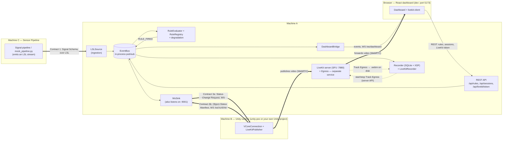
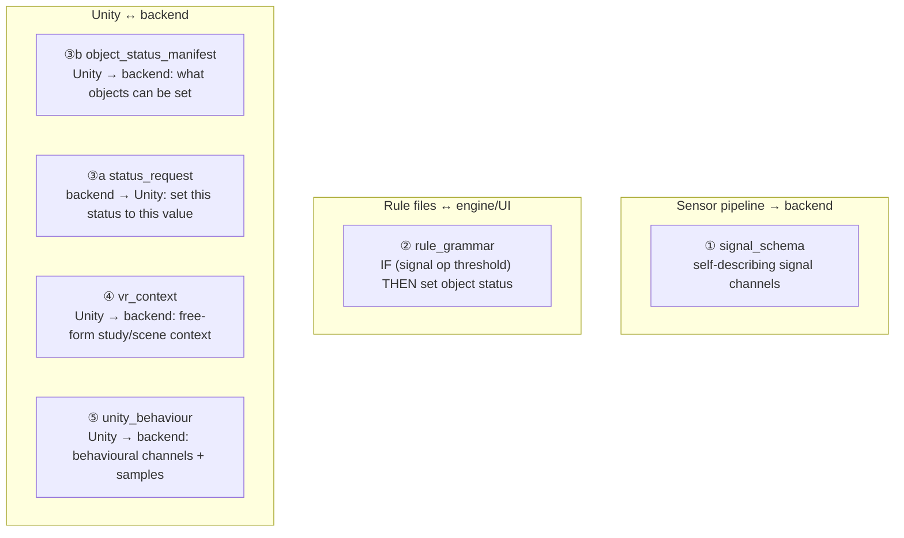
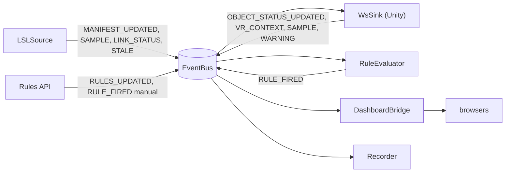
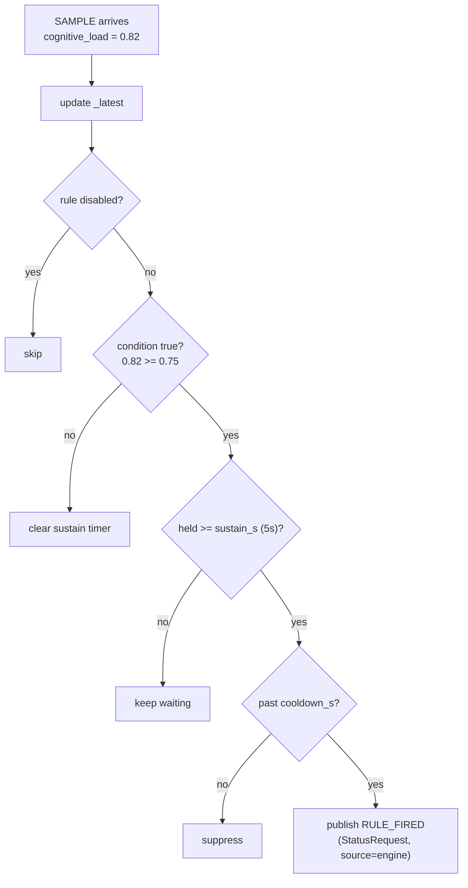
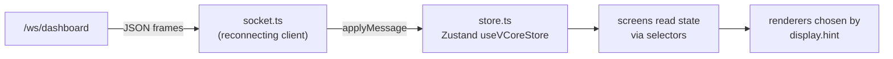
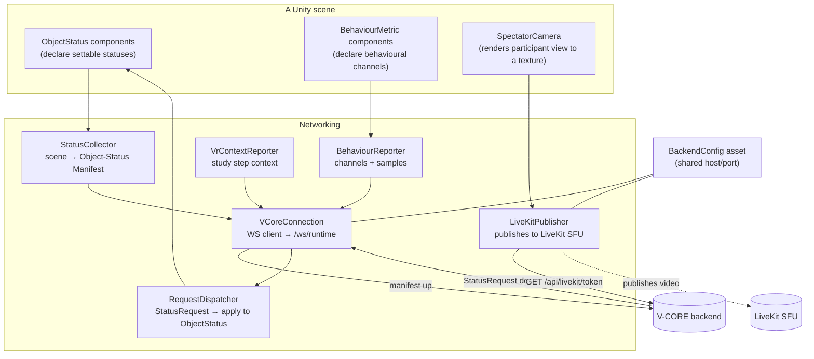
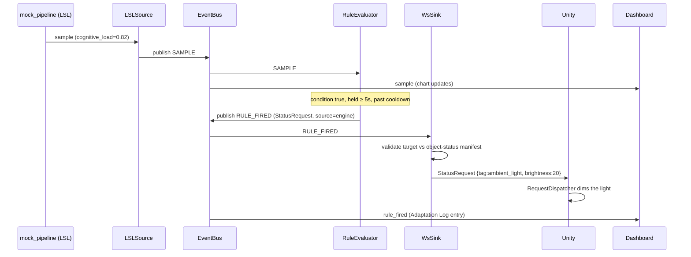
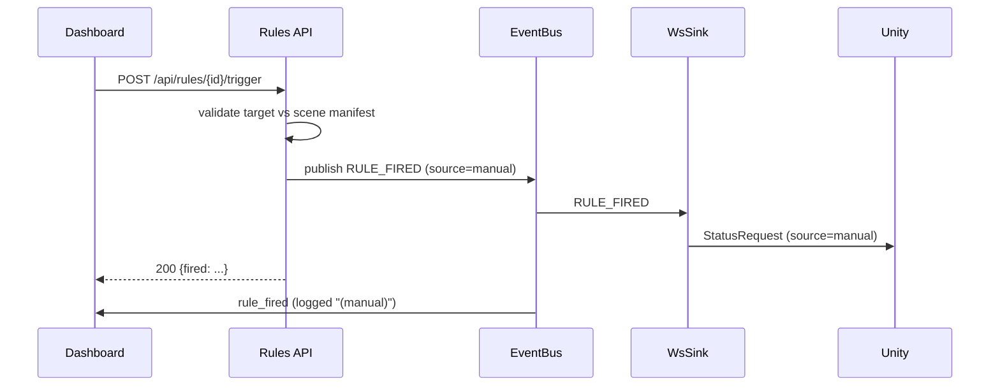
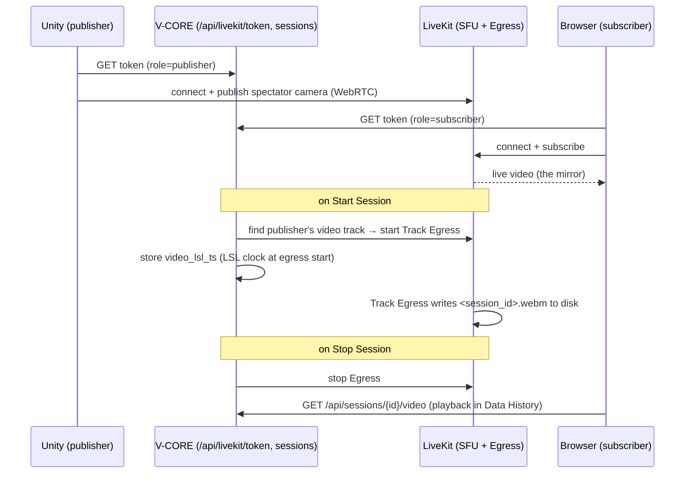

# V-CORE — How It Works (As-Built)

> **What this document is.** A teaching-style, end-to-end walkthrough of how the V-CORE
> system *actually behaves in the current repo* — backend, frontend, the Unity POC, and the
> sensor pipeline. It is written to be read top-to-bottom by a software-engineering student.
>
> **How it relates to [`ARCHITECTURE.md`](../ARCHITECTURE.md).** That file is the *design*
> doc (the intended plan). This file is the *as-built* doc (what the code does today). Where
> they differ, this document wins and the difference is called out in
> [§11 As-built notes & discrepancies](#11-as-built-notes--discrepancies).

---

## Table of contents

1. [The 30-second mental model](#1-the-30-second-mental-model)
2. [Runtime topology: who talks to whom](#2-runtime-topology-who-talks-to-whom)
3. [The contracts: the "languages" each part speaks](#3-the-contracts-the-languages-each-part-speaks)
4. [Backend deep dive](#4-backend-deep-dive)
5. [The frontend deep dive](#5-the-frontend-deep-dive)
6. [The Unity POC deep dive](#6-the-unity-poc-deep-dive)
7. [The sensor pipeline & mock tooling](#7-the-sensor-pipeline--mock-tooling)
8. [End-to-end walkthroughs](#8-end-to-end-walkthroughs)
9. [The participant video plane (LiveKit)](#9-the-participant-video-plane-livekit)
10. [How to run the whole thing locally](#10-how-to-run-the-whole-thing-locally)
11. [As-built notes & discrepancies](#11-as-built-notes--discrepancies)

---

## 1. The 30-second mental model

V-CORE is **middleware** for a VR research study. Picture a participant in a VR headset while
sensors read their body and behaviour. V-CORE sits in the middle and does three things:

1. **Reads signals** about the participant's cognitive state (e.g. cognitive load, heart-rate
   variability, an "affect" label like *stressed*), plus behavioural metrics from the VR app
   (e.g. response latency, idle time).
2. **Evaluates rules** like *"IF cognitive load ≥ 0.75 for 5 seconds THEN dim the lights"*.
3. **Sends commands** to the VR scene to adapt the environment, and shows the researcher a
   **live dashboard** (charts + a video mirror of what the participant sees).

The whole thing is built around one idea: **the core code never changes when you add a new
sensor, a new rule, or a new VR scene.** That is achieved with *contracts* — versioned JSON
message formats that each part agrees to speak. Add a signal? The dashboard renders it
automatically. Swap the VR scene? Rules still work as long as the scene declares what it can
do. This is the "plug-and-play along three axes" requirement.

---

## 2. Runtime topology: who talks to whom

The system is designed to run on **three machines** on a lab LAN, but it runs perfectly on
**one machine** for development (everything on `localhost`).



**The links you'll see named in the UI** (defined in
[`frontend/src/ws/links.ts`](../frontend/src/ws/links.ts)):

| Wire key | UI label | What it means |
|---|---|---|
| `sensor-pipeline` | Sensor Pipeline | The LSL stream is delivering samples. **The critical health signal.** |
| `unity-ws` | Unity WS | A Unity runtime is connected on the control WebSocket. |
| `browser-ws` | Browser WS | At least one dashboard browser is connected. |

**Ports at a glance** (defaults; configurable via `config.yaml` / `LIVEKIT_SETUP.md`):

- **8000** — FastAPI: serves `/ws/dashboard`, `/ws/runtime`, and all REST (incl.
  `/api/livekit/token`).
- **9001** — A *second*, standalone WebSocket server run by `WsSink`. Used by the headless
  `mock_unity.py`. The real Unity POC uses `8000/ws/runtime` instead. Both funnel into the
  same handler.
- **7880 / 7881 / 7882·udp** — LiveKit server: signaling + server API (7880), RTC over TCP
  (7881, fallback), and RTC media (UDP **7882** — a single port; the stack avoids the
  Windows-reserved 50000+ range). The video plane lives here, not in FastAPI.
- **5173** — Vite dev server for the frontend, which **proxies** `/api` and `/ws` to the
  backend (see [`frontend/vite.config.ts`](../frontend/vite.config.ts)).

---

## 3. The contracts: the "languages" each part speaks

Contracts are **JSON Schema** files in [`contracts/`](../contracts). They are the single
source of truth for cross-language messages, validated on both the Python and TypeScript
sides. The design doc talks about "three contracts"; the running code actually uses **five**
message types (the original three plus two Unity→backend extensions).



| # | Schema file | Direction | Carries |
|---|---|---|---|
| ① | `signal_schema.schema.json` | pipeline → backend | channels: `name · unit · type (scalar/timeseries/categorical) · range · display.hint` |
| ② | `rule_grammar.schema.json` | files ↔ engine/UI | `when` (conditions) → `then.set` (target, status, value) + cooldown |
| ③a | `status_request.schema.json` | engine → Unity | `{target, status, value, source: engine\|manual}` |
| ③b | `object_status_manifest.schema.json` | Unity → engine | each object's `id`, `tags`, and settable `statuses` |
| ④ | `vr_context.schema.json` | Unity → backend | open map of `label → value` (e.g. current scene/step) |
| ⑤ | `unity_behaviour.schema.json` | Unity → backend | behavioural channels (same shape as ① channels) + sample frames |

**Why a "display hint"?** Each signal channel carries a `display.hint` string like
`stat_card`, `line_chart`, or `quadrant`. The dashboard uses that string to pick a UI
component. An *unknown* hint doesn't crash — it falls back to a generic renderer. That's how
adding a new sensor needs **zero** UI code.

**Why "tags" on objects?** A rule can target `{tag: ambient_light}` instead of a specific
object id. Any scene that has *something* tagged `ambient_light` will respond. That's how
rules stay portable across VR scenes.

Each schema has matching `valid` + `invalid` golden examples in
[`contracts/examples/`](../contracts/examples) that drive cross-language contract tests.

---

## 4. Backend deep dive

The backend is Python 3.11 + FastAPI ([`backend/pyproject.toml`](../backend/pyproject.toml)).
Everything is wired together in one place: the **composition root**,
[`backend/vcore/app.py`](../backend/vcore/app.py).

### 4.1 The composition root (`app.py`)

`create_app()` builds every component once and connects them, then FastAPI's `lifespan`
starts and stops them. Simplified:

```python
bus       = EventBus()
manifests = ActiveManifests()
registry  = RuleRegistry(rules_dir)
evaluator = RuleEvaluator(registry, bus, manifests)
ws_sink   = WsSink("localhost", 9001, bus=bus, manifests=manifests)
bridge    = DashboardBridge(bus, manifests, registry, evaluator, ws_sink)
recorder  = Recorder(bus, manifests, xdf_dir=xdf_dir, sqlite_path=sqlite_path)
livekit_recorder = LiveKitRecorder(config.livekit, recorder.store, video_dir)
```

On startup it loads the rules, starts the evaluator, begins watching the rules directory,
starts the WebSocket sink + dashboard bridge + recorder, and — if the default signal manifest
exists — starts an `LSLSource` reading the stream named `sensor.cognitive`.

> **Configuration:** `create_app()` now calls `load_config()`
> ([core/config.py](../backend/vcore/core/config.py)) to read
> [`backend/config.yaml`](../backend/config.yaml) (or `$VCORE_CONFIG`); a missing file falls
> back to defaults that match the values in `config.yaml`. Relative paths are resolved against
> the `backend/` directory, so behaviour is the same regardless of the working directory. The
> keyword arguments to `create_app()` (used by tests) are **overrides** that win over config.
> Not every key is consumed yet — each is tagged `(wired)` or `(reference only)` in
> `config.yaml`. See [§11](#11-as-built-notes--discrepancies).

### 4.2 The EventBus — the spine

[`core/eventbus.py`](../backend/vcore/core/eventbus.py) is a tiny in-process publish/subscribe
bus. Components never call each other directly; they publish events to *topics* and subscribe
to the topics they care about. This is what decouples ingestion from the engine from the
dashboard.



The topics (constants in `Topics`): `SAMPLE`, `MANIFEST_UPDATED`, `OBJECT_STATUS_UPDATED`,
`RULE_FIRED`, `RULES_UPDATED`, `WARNING`, `LINK_STATUS`, `STALE`, `VR_CONTEXT`. Handlers are
async; an exception in one handler is logged and swallowed so it can't take down the bus.

### 4.3 Ingestion — getting signals in

[`ingestion/lsl_source.py`](../backend/vcore/ingestion/lsl_source.py) is the only ingestion
source wired into the running app. **LSL** (Lab Streaming Layer) is a standard for streaming
time-synced biosignals over a network. `LSLSource`:

1. Loads a Contract-1 **signal manifest** from a JSON sidecar file (default:
   [`tools/fixtures/full_session.manifest.json`](../tools/fixtures/full_session.manifest.json)).
   This tells it the channel names/types/order.
2. Resolves the live LSL stream by name (`sensor.cognitive`), retrying until it appears.
3. On each sample, maps the raw numeric array to `{channel_name: value}` (decoding categorical
   channels from an index back to a string), and publishes a `SAMPLE` event.
4. Runs a **watchdog**: if no sample arrives within `stale_timeout_s`, it emits a `STALE`
   event and flips the `sensor-pipeline` link to `stale`, then `down` if it stays silent.

There's also [`ingestion/replay_source.py`](../backend/vcore/ingestion/replay_source.py) — a
CSV-replay source that needs no LSL runtime — but it is **only used in tests**, not by
`app.py`. Both implement the [`SignalSource`](../backend/vcore/ingestion/base.py) interface,
which is the *adapter* pattern: swap the source without touching the engine.

### 4.4 The rule engine

Two pieces work together:

**`RuleRegistry`** ([`engine/registry.py`](../backend/vcore/engine/registry.py)) loads every
`*.yaml` / `*.yml` / `*.json` file in `backend/rules/`, validates each against the
`rule_grammar` schema *and* the pydantic `Rule` model, and keeps them in a dict keyed by
`rule.id`. A bad file is skipped and recorded as an error — the others still load. It uses
**watchdog** to hot-reload: edit a rule file and the change takes effect immediately, with no
restart. (The watcher runs on its own thread and safely hands changes back to the asyncio loop
via `run_coroutine_threadsafe`.)

**`RuleEvaluator`** ([`engine/evaluator.py`](../backend/vcore/engine/evaluator.py)) is the
brain:

- It keeps `_latest`: a flat dict of the most recent value for every signal seen.
- On **every** `SAMPLE` event it updates `_latest` and re-checks all enabled rules.
- A condition like `cognitive_load >= 0.75` with `sustain_s: 5` must stay true for 5 real
  seconds (tracked with a monotonic clock) before it contributes to firing.
- When a rule's `when` group passes, the rule fires — unless it's still within its
  `cooldown_s` window since the last fire.
- Firing means: build a `StatusRequest` with `source: "engine"` and publish it on
  `RULE_FIRED`.

A worked example of the firing logic:



**Graceful degradation** ([`engine/degradation.py`](../backend/vcore/engine/degradation.py))
is the safety net. Whenever rules, the signal manifest, or the object-status manifest change,
`reconcile()` recomputes which rules *can't* run and **disables** them with a human-readable
reason instead of crashing. A rule is disabled if:

- it references a signal that doesn't exist in the current manifest, or
- its `then.set` target/status doesn't resolve against the current Unity scene, or its value
  is out of the declared range / not in the allowed discrete values.

The disabled set (and reasons) is sent to the dashboard, which greys those rules out.

Here's an actual shipped rule ([`backend/rules/dim_lights_overload.yaml`](../backend/rules/dim_lights_overload.yaml)):

```yaml
id: dim-lights-overload
schema_version: "1.0.0"
description: "Dim lights on sustained high cognitive load"
enabled: true
when:
  all:
    - signal: cognitive_load
      op: ">="
      threshold: 0.75
      sustain_s: 5
then:
  set:
    target: { tag: ambient_light }
    status: brightness
    value: 20
  cooldown_s: 30
```

### 4.5 Outbound — talking to Unity (`WsSink`)

[`outbound/ws_sink.py`](../backend/vcore/outbound/ws_sink.py) is the boundary with the Unity
runtime, and it's busier than its name suggests. It is both:

- a **standalone WebSocket server** on `localhost:9001` (for `mock_unity.py` / direct
  clients), and
- the **handler** for FastAPI's `/ws/runtime` on port 8000 (the real Unity POC connects here;
  the bridge adapts the FastAPI socket and calls the same `handle_connection`).

It holds a single active Unity connection. **Inbound** (Unity → backend) frames are typed
envelopes `{"type": ..., "payload": ...}` and are routed by type:

| Inbound type | Handler does |
|---|---|
| `object_status_manifest` (③b) | validate, store as active manifest, publish `OBJECT_STATUS_UPDATED` |
| `vr_context` (④) | keep scalar fields, publish `VR_CONTEXT` |
| `behaviour_manifest` (⑤) | merge Unity's behavioural channels into the signal manifest, publish `MANIFEST_UPDATED` |
| `behaviour_sample` (⑤) | publish as a normal `SAMPLE` event on stream `unity.behaviour` |

That last point is elegant: **behavioural metrics from Unity flow through the exact same
pipeline as sensor signals** — they render on the dashboard, feed the rule engine, and get
recorded, with no special-casing.

**Outbound** (backend → Unity): when a `RULE_FIRED` event appears, `WsSink` runs
`_validate_request()` against the active object-status manifest first. If the target/status/
value doesn't resolve, it **drops the request and emits a `WARNING`** rather than sending
garbage to Unity. Otherwise it serializes the `StatusRequest` and sends it down the socket.

### 4.6 The dashboard bridge

[`bridge/ws.py`](../backend/vcore/bridge/ws.py) (`DashboardBridge`) serves `/ws/dashboard`. It
subscribes to *every* bus topic and **broadcasts** each as `{"type": "<slug>", "payload": ...}`
to all connected browsers. When a browser connects, it first pushes a **full snapshot** (the
current signal manifest, object-status manifest, rule list, and link states) so a freshly
opened dashboard is immediately populated, then streams live events. It also owns the
`browser-ws` link status and delegates `/ws/runtime` to `WsSink`.

### 4.7 The video plane (LiveKit) and how V-CORE drives it

The participant video does **not** flow through FastAPI. A separate **LiveKit** server (an SFU)
handles all media: Unity publishes its spectator camera to it, browsers subscribe for the live
mirror, and **LiveKit Egress** records. V-CORE is only the *orchestrator*:

- [`api/livekit.py`](../backend/vcore/api/livekit.py) — `GET /api/livekit/token` mints a LiveKit
  access token (publisher token for Unity, subscriber token for the browser).
- [`recording/livekit_recorder.py`](../backend/vcore/recording/livekit_recorder.py)
  (`LiveKitRecorder`) — on session start it finds the publisher's video track and starts a
  **Track Egress** recording to `<video_dir>/<session_id>.webm`, capturing the LSL clock at that
  moment; on session stop it stops the egress. It's gated by `livekit.enabled` and best-effort
  (a recording failure never aborts the session). See [§9](#9-the-participant-video-plane-livekit).

V-CORE never touches the media bytes itself; LiveKit does.

### 4.8 Recording

[`recording/recorder.py`](../backend/vcore/recording/recorder.py) subscribes to `SAMPLE`,
`RULE_FIRED`, `WARNING`, `VR_CONTEXT`, and `LINK_STATUS`. When a session is active it persists:

Each artifact type has its own independently-configurable location
(`recording.xdf_dir` / `video_dir` / `sqlite_path` in `config.yaml`):

- **SQLite** (`backend/data/vcore.db`): the session row + a timeline of events (rule fires,
  warnings, vr_context changes, link state changes). The filename is configurable.
- **XDF** (`backend/data/xdf/<session_id>.xdf`): the raw numeric signal samples, in the
  LSL-native recording format, so they can be replayed/aligned later.
- **Video** (`backend/data/video/<session_id>.webm`): the recorded participant view, written
  server-side by **LiveKit Egress** (see §4.7) and referenced from the session row.

### 4.9 The REST API

- [`api/rules.py`](../backend/vcore/api/rules.py) — `GET/POST/PUT/DELETE /api/rules` (the UI
  authors rules as YAML files here; files stay the source of truth) plus
  `POST /api/rules/{id}/trigger` to **manually fire** a rule (`source: "manual"`), validated
  against the scene first.
- [`api/sessions.py`](../backend/vcore/api/sessions.py) — start/stop/list/get sessions, plus
  `GET /api/sessions/{id}/video` to stream the recorded file for playback. (Recording is
  started/stopped server-side by `LiveKitRecorder` on session start/stop — there's no browser
  upload endpoint anymore.)
- [`api/livekit.py`](../backend/vcore/api/livekit.py) — `GET /api/livekit/token` (see §4.7).

---

## 5. The frontend deep dive

The dashboard is React 19 + TypeScript + Vite
([`frontend/package.json`](../frontend/package.json)). In development it runs on `:5173` and
proxies `/api` + `/ws` to the backend on `:8000`.

### 5.1 The data flow into the UI



- [`ws/socket.ts`](../frontend/src/ws/socket.ts) — one WebSocket client with exponential
  backoff reconnect (1s → 16s). Every frame is parsed and handed to the store.
- [`ws/store.ts`](../frontend/src/ws/store.ts) — a **Zustand** store, `useVCoreStore`, holding
  *all* live state: the manifests, `latestValues` (newest value per channel), `history` (a
  300-sample ring buffer per channel for charts), the rule list + disabled set, `warnings`,
  `adaptations` (the log of rule firings), link statuses, vr context, and the active session
  id. Its `applyMessage()` is a single switch over the server message types.

### 5.2 Schema-driven rendering (the key trick)

The dashboard does **not** hardcode which charts to draw. Instead
[`renderers/registry.ts`](../frontend/src/renderers/registry.ts) maps a `display.hint` string
to a React component, registered at startup in
[`main.tsx`](../frontend/src/main.tsx):

```
stat_card  → StatCard
line_chart → LineChart
quadrant   → Quadrant
(unknown)  → FallbackRenderer
```

For each channel in the manifest, `getRenderer(channel)` returns the component for its hint;
if the hint is unknown it falls back by channel *type*, and finally to a generic
`FallbackRenderer`. **This is why a brand-new sensor channel just appears on the dashboard
with no code change.**

### 5.3 The screens

- **Session Monitor** ([`screens/SessionMonitor.tsx`](../frontend/src/screens/SessionMonitor.tsx))
  — the main live view: a link-status strip, the participant **VideoFeed**, signal panels
  grouped by `display.group` (e.g. *Physiological*, *Behavioural Markers*), a live **VR
  Context** panel fed by Unity, a **Warnings** log, an **Available Rules** panel (click a rule
  to manually trigger it via `/api/rules/{id}/trigger`; disabled rules are greyed with their
  reason), and an **Adaptation Log** of rule firings.
- **Rule Manager** ([`screens/RuleManager.tsx`](../frontend/src/screens/RuleManager.tsx)) —
  list + create/edit rules, persisted through `/api/rules`.
- **System Config** ([`screens/SystemConfig.tsx`](../frontend/src/screens/SystemConfig.tsx)) —
  connection health for the three links.
- **Data History** ([`screens/DataHistory.tsx`](../frontend/src/screens/DataHistory.tsx)) —
  browse past sessions, their event logs, and recorded video.
- **New Session** ([`screens/NewSession.tsx`](../frontend/src/screens/NewSession.tsx)) — enter
  a participant id + notes and `POST /api/sessions` to begin recording.

### 5.4 The video provider

[`video/VideoSessionProvider.tsx`](../frontend/src/video/VideoSessionProvider.tsx) fetches a
subscriber token from `/api/livekit/token`, connects to the LiveKit room with the
[`livekit-client`](https://github.com/livekit/client-sdk-js) SDK, and exposes the remote video
track to `<VideoFeed>` for the live mirror. It only *views* — **recording is server-side**
(LiveKit Egress). (Details in [§9](#9-the-participant-video-plane-livekit).)

---

## 6. The Unity POC deep dive

`unity-poc/` is a thin, package-ready Unity reference implementation that plays the role of
the VR runtime so the whole loop is demonstrable without the partner's real Unity
project. The reusable client ships as an embedded **UPM package** — its scripts live in
[`unity-poc/Packages/com.vcore.client/Runtime/`](../unity-poc/Packages/com.vcore.client/Runtime)
and are namespaced `VCore`. (The demo scene's `Assets/Scripts/` holds only `StatusVisualizer.cs`.)



- **`ObjectStatus`** ([ObjectStatus.cs](../unity-poc/Packages/com.vcore.client/Runtime/ObjectStatus.cs)) — put one
  on any GameObject to declare a settable status (continuous like `brightness 0–100`, or
  discrete like `density: off/low/high`), addressable by `id` or `tags`. You wire its
  `OnContinuousValue`/`OnDiscreteValue` UnityEvents in the Inspector to the actual effect (e.g.
  a Light's intensity).
- **`StatusCollector`** ([StatusCollector.cs](../unity-poc/Packages/com.vcore.client/Runtime/StatusCollector.cs))
  — scans the scene for all `ObjectStatus` components and builds the Contract-3b manifest.
- **`VCoreConnection`** ([VCoreConnection.cs](../unity-poc/Packages/com.vcore.client/Runtime/VCoreConnection.cs))
  — the WebSocket client to `/ws/runtime` (port 8000). On connect it sends the manifest
  (handshake), then listens for `StatusRequest`s and hands them to the dispatcher on Unity's
  main thread. It reconnects with exponential backoff and re-syncs on scene changes.
- **`RequestDispatcher`** ([RequestDispatcher.cs](../unity-poc/Packages/com.vcore.client/Runtime/RequestDispatcher.cs))
  — resolves an incoming request's `tag`/`id` to the matching `ObjectStatus` components and
  applies the value; unresolved targets are logged and dropped.
- **`BehaviourReporter` + `BehaviourMetric`** — declare behavioural channels (Contract ⑤) and
  stream their values (real or synthetic) to the backend.
- **`VrContextReporter`** — pushes study/scene context (Contract ④) for the dashboard's VR
  Context panel.
- **`SpectatorCamera` + `LiveKitPublisher`** — render the participant's view to a texture and
  publish it to the **LiveKit** room; `LiveKitPublisher` ([LiveKitPublisher.cs](../unity-poc/Packages/com.vcore.client/Runtime/LiveKit/LiveKitPublisher.cs))
  fetches a token from `/api/livekit/token` and publishes via the LiveKit Unity SDK.
- **`BackendConfig`** ([BackendConfig.cs](../unity-poc/Packages/com.vcore.client/Runtime/BackendConfig.cs)) — a
  shared `ScriptableObject` holding the backend host/port so the networked components
  point at the same place.

> **Recording** is server-side via LiveKit Egress (see [§9](#9-the-participant-video-plane-livekit)).

### 6.1 Reusing the Unity client as a package

The client is an embedded **UPM package** (`com.vcore.client`), so it can be dropped into *any*
Unity project — not just this POC. To consume it elsewhere: copy
[`unity-poc/Packages/com.vcore.client/`](../unity-poc/Packages/com.vcore.client) into the target
project's `Packages/`, or reference it by path in that project's `manifest.json`
(`"com.vcore.client": "file:../path/to/com.vcore.client"`); for video, also add the LiveKit Unity
SDK. Then drop the `VCore` prefab (or add a `VCoreLauncher` component) and assign a `BackendConfig`.

Full instructions live with the package:
[`com.vcore.client/README.md`](../unity-poc/Packages/com.vcore.client/README.md) (install + the
component/API reference) and [`unity-poc/README.md`](../unity-poc/README.md) (the field-by-field
"drop V-CORE into your own scene" walkthrough).

---

## 7. The sensor pipeline & mock tooling

The real "Machine C" is an external Python signal-processing pipeline that emits an LSL
stream. You don't need it (or any hardware, or even Unity) to run V-CORE — two mock tools fill
in.

### `tools/mock_pipeline.py` — fake sensors

Reads the fixture signal manifest and streams **synthetic** samples over LSL at the manifest's
rate. The default fixture
([`full_session.manifest.json`](../tools/fixtures/full_session.manifest.json)) declares the
stream `sensor.cognitive` with three channels:

| Channel | Type | Renders as |
|---|---|---|
| `cognitive_load` | scalar (0–1) | stat card |
| `hrv` | timeseries (40–120 BPM) | line chart |
| `affect` | categorical (calm/stressed/bored/engaged) | quadrant |

Values follow a slow sine wave by default (`--pattern sine|ramp|high`, `--rate`, `--scale`),
so threshold rules trigger naturally over time. Categorical channels are encoded as an integer
index on the wire and decoded back by `LSLSource`.

### `tools/mock_unity.py` — fake Unity

Connects to `WsSink` (default `:9001`), sends an **Object-Status Manifest** (a `light-1`
tagged `ambient_light` with continuous `brightness`, and a `fog-1` tagged `fog` with discrete
`density`), then:

- walks a fake study session, pushing a `vr_context` message per step, and
- declares **behavioural channels** (`response_latency`, `idle_time`, `task_accuracy`, …) and
  streams `behaviour_sample` frames.

It prints any `StatusRequest`s it receives. Between `mock_pipeline` (which provides
`cognitive_load` + `affect`) and `mock_unity` (which provides `response_latency` + `idle_time`
+ the objects), **all the shipped rules can resolve and fire** — the full loop runs with no
hardware and no Unity.

---

## 8. End-to-end walkthroughs

### 8.1 A signal drives an automatic adaptation



### 8.2 The researcher manually triggers a rule



### 8.3 Adding a new sensor (zero code changes)

1. The pipeline adds a `pupil_diameter` channel (`timeseries`, `display.hint: line_chart`) to
   its manifest.
2. `LSLSource` reads it; `ActiveManifests` validates + version-checks and publishes
   `MANIFEST_UPDATED`.
3. `DashboardBridge` forwards the new manifest; the store swaps it in.
4. Session Monitor asks the registry for a renderer: `line_chart → LineChart`. A new chart
   appears. **No code changed.** (An *unknown* hint would use the `FallbackRenderer`.)

---

## 9. The participant video plane (LiveKit)

The researcher watches a **live mirror of the participant's VR view** next to the signals, and
that view is recorded for later. This is a separate "plane" handled by a **LiveKit** SFU — it
doesn't affect the signal/rule path. V-CORE only mints tokens and starts/stops the recording;
the media flows through LiveKit, not FastAPI.



- **Unity publishes**, the **browser subscribes** (live mirror) — both via the LiveKit SDKs.
- **Recording is server-side**: `LiveKitRecorder` drives **Track Egress** (records the single
  published track directly — no headless-Chrome compositor), anchored to the LSL clock so the
  `.webm` lines up with the XDF at `t=0`.
- V-CORE's only video role is **tokens + egress control**; it never relays media bytes.

---

## 10. How to run the whole thing locally

You need Python 3.11+ and Node 20+. Four processes, four terminals (LSL tools need `liblsl`
available for `pylsl`).

```bash
# 1) Backend  (from backend/)
uv run uvicorn vcore.app:app --reload --host 0.0.0.0 --port 8000
# or, to bind using config.yaml's bridge.host/port instead of CLI flags:
#   uv run python -m vcore.app     (no autoreload)
# point at a different config with:  VCORE_CONFIG=/path/to/config.yaml

# 2) Frontend (from frontend/)  → http://localhost:5173
npm install && npm run dev

# 3) Mock sensor pipeline (no hardware) — streams synthetic LSL
uv run python tools/mock_pipeline.py

# 4) Mock Unity (no Unity) — connects to WsSink on :9001
uv run python tools/mock_unity.py --port 9001
```

Then open `http://localhost:5173`, create a session in **New Session**, and watch **Session
Monitor**: charts move, behavioural metrics update, rules fire into the Adaptation Log, and
you can click a rule to fire it manually.

To run with the **real Unity POC** instead of `mock_unity.py`, open `unity-poc/` in Unity,
make sure the components' `BackendConfig` points at the backend host (`localhost:8000`), and
press Play — `VCoreConnection` connects to `8000/ws/runtime`, and `LiveKitPublisher` fetches a
token from `8000/api/livekit/token` and publishes video to the LiveKit SFU. For the full video
stack (LiveKit + Egress recording) use Docker — see [`LIVEKIT_SETUP.md`](LIVEKIT_SETUP.md).

**Tests:**

```bash
cd backend  && uv run pytest        # backend
cd frontend && npm test             # frontend (vitest)
cd frontend && npm run build        # type-check + production build
```

---

## 11. As-built notes & discrepancies

These are places where the running code differs from the design doc / README, captured here so
nobody is misled. None of them stop the system from running end-to-end.

1. **Resolved — `config.yaml` is now read.** `create_app()` calls `load_config()` and sources
   the rules dir, the XDF/video dirs + SQLite path, LSL stream name, signal manifest path, stale timeout,
   the standalone `WsSink` host/port, and (via `python -m vcore.app`) the bind host/port from
   [`config.yaml`](../backend/config.yaml). Defaults match the previous hardcoded values, so
   behaviour is unchanged. Keys that documented unbuilt or non-backend behaviour (the WS route
   paths, the Unity-side reconnect backoff, `sqlite_enabled`, and the whole `video` block) have
   been removed, so the file now contains only keys the code reads — plus two still tagged
   `(reference only)`: `outbound.transport` (only `ws` is implemented) and `bridge.bearer_token`
   (auth not implemented). The `create_app()` keyword arguments remain as test overrides.

2. **Resolved — duplicate rule file removed.** Previously two files
   (`clear-fog-stressed.yaml` and `clear_fog_stressed.yaml`) both declared
   `id: clear-fog-stressed`; because the registry keys rules by `id`, one silently overwrote
   the other. The hyphenated duplicate (which also had a `"stressedf"` typo and didn't match
   the underscore naming of the other rule files) has been deleted.
   [`clear_fog_stressed.yaml`](../backend/rules/clear_fog_stressed.yaml) is now the single
   canonical version.

3. **Video runs on LiveKit.** The participant video plane is a **LiveKit** SFU with server-side
   **Track Egress** recording (§4.7, §9). The
   one knob you must set per machine is LiveKit's `node_ip` (your LAN IP) — see
   [`LIVEKIT_SETUP.md`](LIVEKIT_SETUP.md). LSL↔video sync uses **two-point** alignment — the
   LSL clock is captured at egress **start** (`video_lsl_ts`) and **stop** (`video_lsl_ts_end`),
   and the frontend linearly maps the video timeline to the LSL timeline (drift-corrected).
   It is **not** frame-accurate: a fixed egress-start offset (up to ~1 s) plus residual jitter
   remain, so it's good for review (≈±tenths of a second), not sub-frame analysis. True
   per-frame sync (timestamps embedded per frame) remains future work.

4. **"Three contracts" vs five message types.** The docs emphasize three contracts, but the
   running system also uses `vr_context` (④) and `unity_behaviour` (⑤), each with its own
   schema + golden examples in [`contracts/`](../contracts).

5. **Two WebSocket entry points for Unity.** `WsSink` runs a standalone server on `:9001`
   *and* handles `/ws/runtime` on `:8000`. `mock_unity.py` uses `:9001`; the real Unity POC
   uses `:8000`. Only one Unity connection is tracked at a time.

6. **Resolved — recording paths are now config-driven and consistent.** SQLite is at
   `backend/data/vcore.db`, XDF at `backend/data/xdf/<session_id>.xdf`, and video at
   `backend/data/video/<session_id>.<ext>` — each from an independent, fully configurable key
   (`recording.sqlite_path` / `xdf_dir` / `video_dir`). The DB filename is configurable
   (default `vcore.db`, no longer `sessions.db`). The old `data_dir`/`vcore.db` mismatch is
   gone, and `Recorder`/`VideoStore` take these paths directly so each artifact can live on
   different storage.
